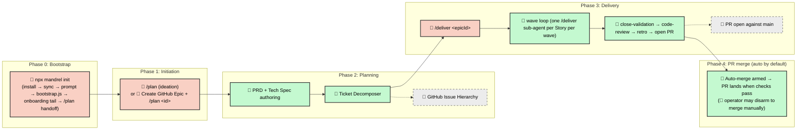

# Software Development Life Cycle (SDLC) Workflow

Mandrel uses **Epic-Centric GitHub Orchestration** — GitHub Issues,
Labels, and Projects V2 are the Single Source of Truth, fronted by a
declarative `epic.yaml` artifact that makes plans diff-able and
reconcilable. No per-iteration directories, no JSON state files for
ticket data.

The framework is **Claude Code-first**: `.claude/`, hooks, skills, and
the slash-command surface lean in on Claude Code as the reference
runtime, and the dispatcher (`.agents/scripts/`) treats the dispatch
manifest (md + structured comment) as the cross-runtime contract. See
ADR 20260512-coupling-stance in [`../docs/decisions.md`](../../docs/decisions.md).

---

## The simple flow

From zero to shipped:

1. **Plan the work.** Run `/plan` in your agentic IDE. The framework
   generates a PRD, a Tech Spec, and an Acceptance Spec, decomposes the
   work into the flat Story backlog under the Epic, and
   transitions the Epic to `agent::ready`.

   The entry point you use selects where the run begins:
   - With **no arguments** (or `--idea "<seed>"`), the workflow enters at
     Phase 1 and runs the ideation phases (1–4) to open a fresh
     `type::epic` Issue before authoring.
   - With **`<epicId>`**, the workflow skips ideation and enters at
     Phase 5 for an Epic Issue you have already opened.

   > **Phase numbering note.** The numbered phases below are
   > `/plan`'s **internal** phases (1–11), not the SDLC-level
   > Phase 0–4 used by the Mermaid diagram in [§ End-to-End
   > Process](#end-to-end-process). Phases 1–4 run **only** on the
   > ideation entry; an existing-Epic invocation starts at Phase 5.

   1. **Phase 1 — idea refinement** *(ideation entry only)* — the
      `idea-refinement` skill drives a divergent → convergent → sharpen
      loop and emits a one-pager with the five canonical Epic sections.
      Stops for operator confirmation of the one-pager.
   2. **Phase 2 — cross-Epic duplicate search** *(ideation entry only)*
      — `lib/duplicate-search.js` ranks open Epics whose scope overlaps
      the one-pager; the operator confirms the idea is distinct or folds
      it into an existing Epic (in which case `/plan` exits).
   3. **Phase 3 — render Epic body** *(ideation entry only)* — renders
      the confirmed one-pager into the canonical Epic-from-idea template
      and stops for a final wording confirmation.
   4. **Phase 4 — open the Epic Issue** *(ideation entry only)* — opens
      the GitHub Issue with **only** the `type::epic` label; the captured
      id flows into the rest of the pipeline.
   5. **Phase 5 — re-plan detection** — checks whether the Epic already
      carries planning artifacts and, if so, prompts before overwriting
      the PRD / Tech Spec / Acceptance Spec in place and recreating the
      child Story tickets.
   6. **Phase 6 — Epic clarity gate** — scores the Epic body against the
      five canonical sections. A `clear` verdict requires ≥ 4 of 5
      sections present **and** the Acceptance Criteria section present (AC
      is required, not optional). A `clear` verdict proceeds silently;
      `needs-refinement` drops into a one-shot refinement loop with a HITL
      diff before persisting the sharpened body.
   7. **Phase 7 — PRD, Tech Spec & Acceptance Spec** — the
      `epic-plan-spec-author` skill authors all three planning artifacts
      as linked context tickets, flips the Epic to `agent::review-spec`,
      and routes high-risk Epics to a HITL review stop (low-risk Epics
      auto-proceed).
   8. **Phase 8 — work-breakdown decomposition** — the
      `epic-plan-decompose-author` skill emits the Epic → Story
      tree (with inline `acceptance[]` / `verify[]` per Story); the
      validator enforces hierarchy, DAG acyclicity, and file-assumption
      invariants.
   9. **Phase 9 — execution roadmap** — runs the dispatcher in dry-run to
      compute waves and posts the `dispatch-manifest` structured comment
      that `/deliver` consumes.
   10. **Phase 10 — readiness health check** — `epic-plan-healthcheck.js`
       runs the default config + git-remote checks; a non-OK result is a
       **blocking** exit condition for the `agent::ready` flip (overridable
       only via the `planning::healthcheck-waived` label).
   11. **Phase 11 — plan comprehension gate** — an opt-in, advisory
       walkthrough of the planned backlog driven by the
       `core/knowledge-transfer` skill. Offered by LM judgment only on
       non-trivial plans, runs **after** the `agent::ready` flip, and is
       interruptible at every checkpoint — it never blocks the hand-off.
   12. **Phase 12 — notification & hand-off** — posts the backlog summary
       comment, @mentions the operator, and names `/deliver` as the
       next step.

2. **Deliver the Epic.** Run `/deliver <epicId>` in your IDE. The
   skill drives the merged execute + close flow end-to-end.

   > **Phase numbering note.** The numbered phases below refer to
   > `/deliver`'s **internal** phases (1–9), not the SDLC-level
   > Phase 0–4 used by the Mermaid diagram in [§ End-to-End
   > Process](#end-to-end-process). When prose elsewhere in this
   > document says "Phase 7", it always means the internal
   > `/deliver` phase unless explicitly prefixed with "SDLC".

   1. **Phase 1 — prepare** — snapshot the Epic, build the wave DAG,
      initialise the `epic-run-state` checkpoint.
   2. **Phase 2 — wave loop** — fan one `/deliver` Agent-tool
      sub-agent out per Story per wave (capped at `concurrencyCap`).
      Stories run in parallel inside the operator's Claude session
      against your Max subscription quota; no subprocess worker sessions
      for Story execution, no GitHub Actions minutes. Deterministic
      Node CLIs remain the state-mutation contract.
   3. **Phase 3 — close-validation** — lint, test, and the project's
      ratcheted baselines run against the Epic branch. Evidence is
      cached by HEAD SHA so re-runs short-circuit.
   4. **Phase 4 — audit** — runs the change-set audit lenses against
      the Epic diff; findings flow through as advisory signal.
   5. **Phase 5 — code-review** — auto-invokes the in-process
      `lib/orchestration/code-review.js` (extracted from the old
      `helpers/code-review.md` helper); findings persist as a
      `code-review` structured comment on the Epic. Critical findings
      halt the run.
   6. **Phase 6 — retro** — auto-invokes the in-process
      `lib/orchestration/retro-runner.js` (extracted from the old
      retro helper) and posts the structured retro comment on the
      Epic. The retro fires **before** the PR is opened so it has
      full env access in the operator's local session.
   7. **Phase 7 — finalize** — pushes `epic/<epicId>` to `origin`,
      opens a pull request to `main`, sets the required-checks
      expectation from `github.branchProtection.requiredChecks`, and
      posts the hand-off comment naming the PR URL. The Epic stays
      at `agent::executing` until the PR merges; the standard
      label-transition pathway flips it to `agent::done` on merge.
      Finalize hands off to the watch / auto-merge / cleanup tail
      below — it does **not** stop the run.
   8. **Phase 8 — watch-and-iterate** — watches CI on the open PR
      until checks turn green (or a failure surfaces for human
      remediation).
   9. **Phase 8.5 — auto-merge** — arms GitHub native auto-merge
      (`gh pr merge --auto --squash --delete-branch`) once the
      required checks have passed so the PR lands without a second
      operator visit. The operator can disarm auto-merge in the
      GitHub UI if they want to gate the merge manually.
   10. **Phase 9 — cleanup** — reaps local Story/Epic branch refs and
       worktrees after the PR merges so the workspace returns to a
       clean state for the next Epic.

   For a single Epic-attached Story (re-driving a hotfix, resuming after
   a halt), re-run `/deliver <epicId>` — the wave loop picks up
   incomplete Stories from the dispatch manifest automatically. Standalone
   Stories (no `Epic: #N` reference) use `/deliver <storyId>` instead.
   Mixed input — several Epics, or Epics plus standalone Stories — is
   accepted in one invocation: `/deliver` composes a **sequential segment
   plan** (the standalone-Story set as one segment, delivered first, then
   each Epic as its own segment in input order) and executes the segments
   one at a time through the same two path helpers, never interleaved.

That is the whole happy path. Everything below is **detail** — branching
conventions, HITL escalation, audit gates — that you only need when the
default flow requires adjustment.

---

## Core Principles

- **Layered state stores with explicit precedence.** Project logic, work
  breakdown, and ticket status live in GitHub Issues and Labels; the
  lifecycle bus (`temp/epic-<id>/lifecycle.ndjson`) is the canonical
  resume target for in-flight runs; structured comments
  (`epic-run-state`, `story-run-progress`) are the operator-visible
  rollup. The seven stores, their owners, and their conflict-resolution
  rules are listed in [§ State stores](#state-stores) — that matrix is
  the single source of truth for "who owns which write" and supersedes
  the earlier "GitHub as SSOT" / "lifecycle ledger canonical" prose.
- **Provider Abstraction.** Orchestration flows through `ITicketingProvider`, an
  abstract interface with a shipped GitHub implementation.
- **Story-Level Branching.** All work for a Story lands on the shared
  `story-<id>` branch. Stories merge into `epic/<epicId>`; the Epic
  branch reaches `main` only via a pull request the operator merges
  through the GitHub UI.
- **Hierarchy-aligned skills.** Execution is split along the ticket
  hierarchy: `/plan` builds the backlog (with optional ideation
  entry), `/deliver` owns the merged wave-loop + close-tail, and
  `/deliver` delivers one or more standalone Stories end-to-end.
  `helpers/epic-deliver-story` and `helpers/single-story-deliver` are the
  per-Story workers called by those two commands respectively. All share
  the same primitives (`Graph.computeWaves`, `cascadeCompletion`,
  `ticketing.js`, `WorktreeManager`).
- **Single-session fan-out.** `/deliver` launches Story sub-agents via
  the Agent tool — every Story runs inside the operator's Claude session,
  with no subprocess boundary. Worktree filesystem isolation is preserved;
  only the process boundary is gone.
- **PR is the sole promotion gate.** `/deliver` ends with a PR open
  against `main` and (by default) GitHub native auto-merge armed; the
  workflow itself never executes `git merge` against `main`. Branch
  protection on `main` enforces required-checks before the merge button
  (auto or manual) fires. The operator can disarm auto-merge in the
  GitHub UI to make the merge an explicit human action.
- **HITL-minimal by default.** Exactly one mandatory operator touchpoint on
  the happy path — blocker resolution mid-run. PR merge is autonomous via
  the armed auto-merge; the operator becomes a second touchpoint only when
  they disarm auto-merge or when required checks fail and need
  remediation.

---

## State stores

Mandrel writes orchestration state across seven distinct stores. Each
store has exactly one canonical writer and one well-defined idempotency
key; conflicts between stores are resolved in the **Conflict
resolution** column. When the same fact appears in more than one store
(common during a run — labels mirror lifecycle events, comments mirror
ledger entries) the entry below names the authoritative reader for that
fact so downstream code does not have to guess.

| State Store                       | Owner (canonical writer)                                                                         | Mutation API                                                                                                  | Idempotency key                                                                | Conflict resolution                                                                                                                |
| --------------------------------- | ------------------------------------------------------------------------------------------------ | ------------------------------------------------------------------------------------------------------------- | ------------------------------------------------------------------------------ | ---------------------------------------------------------------------------------------------------------------------------------- |
| GitHub labels                     | `transitionTicketState` via `ticketing.js`                                                       | `gh issue edit --add-label / --remove-label`, wrapped in `update-ticket-state.js`                              | `(ticketId, label-set)` — set-equality check before write                      | Authoritative for current ticket lifecycle state; if the label disagrees with the lifecycle ledger, the **ledger wins on resume** and the label is re-derived. |
| `epic-run-state` comment          | `checkpointer` submodule in the Epic Deliver Runner                                              | `post-structured-comment.js` (upsert by `kind`)                                                                | `(epicId, kind='epic-run-state')`                                              | Operator-visible rollup of phase progress; on conflict with the lifecycle ledger, the ledger is authoritative and the comment is re-rendered. |
| `story-run-progress` comment      | `story-phase.js` (per Story, per phase transition)                                               | `post-structured-comment.js` (upsert by `kind`)                                                                | `(storyId, kind='story-run-progress')`                                         | Authoritative for Story-level phase progress; the wave aggregator reads this comment, not labels.                                   |
| Lifecycle ledger NDJSON           | `lifecycle-emit.js` (single append-only writer per Epic run)                                     | Append-only line write to `temp/epic-<id>/lifecycle.ndjson`                                                    | `(epicId, eventId)` — `eventId` is a content hash of `{type, ts, payload}`     | **Canonical resume target.** When labels / comments disagree with the ledger, the ledger wins and the others are re-derived from it. |
| Validation evidence cache         | `evidence-gate.js`                                                                               | JSON cache file under `temp/epic-<id>/evidence/<gate>/<sha>.json`                                              | `(gate, git rev-parse HEAD)`                                                   | Pure cache: a missing entry triggers a re-run; presence is a fast-path skip. Cache eviction is safe.                                |
| PR / auto-merge state             | `AutomergeArmer` listener (sole authorized caller of `gh pr merge`)                              | `gh pr merge --auto --squash --delete-branch`; PR open via `openOrLocatePr` in `Finalizer`                     | `(prNumber, head-branch SHA)` — `gh pr view` probes existing PR before create  | GitHub is authoritative for PR + auto-merge arming state; the lifecycle ledger records the *intent* to arm, GitHub records the outcome.   |
| Worktree cleanup state            | `WorktreeManager.reap` (via `story-close.js` / cleanup state)                                    | `git worktree remove` + on-disk pending-cleanup JSON under `temp/epic-<id>/worktree-cleanup.json`              | `(storyId, worktree-path)`                                                     | Filesystem is authoritative for "is the worktree gone?"; the pending-cleanup JSON only tracks Windows stale-registry entries that need a follow-up sweep. |

---

## End-to-End Process



---

## Phase 0: Bootstrap (One-Time Setup)

Before any Epic workflow, bootstrap your project to seed `.agentrc.json`,
wire the framework system prompt, and create the GitHub labels, Projects V2
fields, and (when enabled) main-branch protection the orchestration engine
depends on.

The canonical cold-start path is a single command:

```bash
npx mandrel init
```

`mandrel init` installs `mandrel` (when `./.agents/` is absent), materializes
`./.agents/` via `mandrel sync`, then presents a two-option prompt: **configure
now** (option 1 → runs `node .agents/scripts/bootstrap.js`, forwarding any flags
you pass) or **just the files** (option 2 → re-run `mandrel init` any time to
configure later). `--assume-yes` skips the prompt and proceeds straight to
configure (and is forwarded to bootstrap); a non-TTY run without it defaults to
files-only so the GitHub provisioning never runs unattended. `bootstrap.js`:

1. **Provisions a cold start.** Initializes the local git repo (with a first
   commit) when absent, creates the GitHub repo (`gh repo create --source=.
   --push`; choose visibility with `--visibility private|public|internal`,
   default `private`), and creates the Projects V2 board (`gh project
   create`) when it doesn't exist. No pre-created repo or remote is required.
2. **Seeds `.agentrc.json`** from `.agents/starter-agentrc.json` (the `github`
   section carries owner, repo, base branch, operator handle, and project
   number — inferred from your local `git` config where possible). See
   `.agents/docs/agentrc-reference.json` for the exhaustive reference of every
   available key.
3. **Creates the label taxonomy and Projects V2 fields**, and — when
   `github.branchProtection.enforce` is `true` (default) — creates or merges
   branch protection on `main` with the project's
   `github.branchProtection.requiredChecks` as required status checks. This
   step is load-bearing for the SDL because PR merges to `main` are the sole
   promotion gate.

When `.agents/` is already materialized you can run the bootstrap directly
(`node .agents/scripts/bootstrap.js`). The guided first-run steps (stack
detection, docs scaffolding, `mandrel doctor` readiness gate, and `/plan`
handoff) are now part of `mandrel init`'s configure path — run
`mandrel init` again to pick them up if you bootstrapped via the script
directly.

> [!NOTE] Bootstrap runs once per repository. It is safe to re-run — existing
> labels, fields, and branch-protection entries are preserved; missing ones
> are added.

---

## Phase 1: Initiation

The product lead defines the objective and triggers planning.

### 1a. Ideation entry (optional)

Run `/plan` with no arguments (or `--idea "<seed>"`) to enter ideation
mode:

1. **Sharpen the idea.** The `idea-refinement` skill drives a divergent →
   convergent → sharpen loop and emits a markdown one-pager with the
   five canonical Epic sections (Context, Goal, Non-Goals, Scope,
   Acceptance Criteria).
2. **Scope triage (Phase 1.5).** Before the ceremony is paid for, the
   one-pager is judged against the story-vs-epic rubric (see the
   subsection below). On a `story` / `borderline` verdict the operator may
   route the work to `/plan` instead of opening an Epic.
3. **Cross-Epic duplicate search.** `lib/duplicate-search.js` queries the
   open Epics in the repo, scores by title + body keyword overlap, and
   surfaces matches above a threshold. The operator either confirms the
   new idea is genuinely distinct or folds it into an existing Epic
   (`/plan` exits and the operator resumes work on the existing
   id).
4. **Render and confirm the Epic body.** The one-pager is rendered into
   the canonical Epic-from-idea template; the operator confirms before
   the GitHub Issue is opened.
5. **Open the Epic.** The Issue is opened with **only** the `type::epic`
   label — no `state::*` label is applied at creation. PRD authoring in
   Phase 1b advances it to `agent::review-spec`.

#### Scope triage

`/plan` Phase 1.5 runs the
[`core/scope-triage`](../skills/core/scope-triage/SKILL.md) rubric over the
sharpened one-pager so a story-sized scope is not pushed through the full Epic
ceremony (PRD + Tech Spec + Acceptance Spec + Story backlog +
`epic/<id>` integration branch) only to land as a degenerate one-Story
output. The rubric anchors its sizing judgment **by reference** to
the existing sizing SSOT (`DELIVERABLE_GRANULARITY_GUIDANCE` /
`DEFAULT_TASK_SIZING` in `ticket-validator-sizing.js`) and emits one of three
verdicts — `epic` | `story` | `borderline`.

The verdict is **host-LLM judgment** (no scorer, no schema, no label
transition) and **advisory** — the operator always decides. It folds into the
existing Phase 1 HITL confirmation rather than adding a second stop: an `epic`
verdict proceeds with a plain confirm, while a `story` / `borderline` verdict
offers a three-way choice (single Story / plan as Epic anyway / abort). On an
accepted `story`, `/plan` hands the one-pager off to
`/plan --from-notes` as a scope-triage handoff and exits. Phase 1.5 is
skipped when `/plan` is itself entered via a scope-triage handoff, so the
two workflows never ping-pong a settled decision.

The same rubric also guards the **existing-Epic entry** (1b) as the
**Phase 5.5 story-sized advisory**, which catches a story-sized scope that was
hand-opened directly as a `type::epic` issue (the Phase 6 Epic Clarity Gate
scores section *presence*, not scope *size*, so a clear-but-thin Epic would
otherwise sail through). The advisory fires **only** when Phase 5 found no
linked PRD / Tech Spec **and** the Epic has no open Story children, so
it never re-triages an Epic that is being re-planned. An `epic` verdict
proceeds silently; a `story` / `borderline` verdict STOPs with the same
three-way choice (convert to a standalone Story / proceed as Epic anyway /
abort). Converting is **close-and-recreate** — a `type::epic` body cannot
satisfy `validateStoryBody`, and editing the issue in place would violate the
"do not modify existing issues without explicit permission" rule — so, only
after the operator confirms, the Epic body seeds a notes file,
`/plan --from-notes` opens a replacement Story (identified as a
scope-triage handoff so it skips its own gate, with a `## Notes` back-link to
the Epic), and the Epic is closed with `gh issue close --comment` cross-linking
the replacement. No deterministic scorer, no schema, and no label transition
sit behind either gate.

The rubric also runs in the **escalation direction** — the symmetric
counterpart in [`/plan`](../workflows/helpers/plan-story.md). After `/plan`
Phase 2 drafts a standalone Story body (the draft, not the seed, is the honest
basis for the judgment), the same `core/scope-triage` rubric judges whether the
scope is actually Epic-sized. The verdict folds into the existing Phase 2
draft-confirmation HITL stop with no extra stop on a `story` verdict; an `epic`
verdict offers a three-way choice (escalate to `/plan --idea` as a
scope-triage handoff / persist as a standalone Story anyway / abort). On an
accepted escalation, `/plan` abandons the draft and hands the notes off to
`/plan --idea`, marked as a handoff so `/plan` skips its own Phase 1.5
gate. This gate is itself skipped when `/plan` was entered via a
scope-triage handoff (from `/plan` Phase 1.5 or the Phase 5.5 conversion
path), so the two workflows never ping-pong a settled decision. As with the
inbound gates, the verdict is advisory and host-LLM judgment — no auto-routing,
no scorer, no schema, and no label transition.

### 1b. Existing-Epic entry

Run `/plan <epicId>` directly when the Epic Issue already exists. The
ideation phases (1a) are skipped.

In both modes the planning flow continues into Phase 2 with the captured
Epic id.

---

## Phase 2: Planning (Autonomous)

The framework reads the Epic and autonomously builds the entire work breakdown.

> **Epic Clarity Gate (`/plan` `planning.clarity-gate` state).** Before PRD / Tech Spec /
> Acceptance Spec authoring kicks off, `/plan` scores the Epic body
> against the five canonical sections from
> [`templates/epic-from-idea.md`](../templates/epic-from-idea.md) (Context,
> Goal, Non-Goals, Scope, Acceptance Criteria). Common legacy heading
> variants (`Problem`, `Direction`, `MVP Scope`, `Not Doing`,
> `Out of Scope`) are accepted by the scorer's regex for back-compat.
> The rubric is deterministic (section-presence): `clear` requires ≥ 4 of 5
> sections present **and** the Acceptance Criteria section present (AC is
> required). A
> `clear` verdict
> skips fast with no prompt; a `needs-refinement` verdict drops into the
> `idea-refinement` skill seeded from the current Epic body, surfaces a
> HITL diff, and on approval persists the sharpened body via
> `gh issue edit` before the `planning.spec-authoring` state begins.
> The gate honours the
> "do not modify existing issues without permission" Constraint — every
> body rewrite is operator-confirmed.

1. **Epic Planner** (`epic-plan-spec.js`):
   - Synthesizes the Epic body with project documentation.
   - Generates a **PRD** (`context::prd`), **Tech Spec**
     (`context::tech-spec`), and **Acceptance Spec**
     (`context::acceptance-spec`) as linked GitHub Issues.

> [!TIP] **PRD authoring — acceptance criteria phrasing.** Write acceptance
> criteria in Gherkin-compatible `Given / When / Then` form so the QA
> acceptance suite can lift them directly into executable `.feature` files. See
> [`rules/gherkin-standards.md`](../rules/gherkin-standards.md) for the canonical
> clause grammar, tag taxonomy, and forbidden patterns.

### Acceptance Spec — the third planning context ticket

Every Epic carries **three** planning context tickets, not two:

| Label                       | Artifact         | Authored by                                         | Drives                                                   |
| --------------------------- | ---------------- | --------------------------------------------------- | -------------------------------------------------------- |
| `context::prd`              | PRD              | `epic-plan-spec-author` skill (PRD persona)         | What we're shipping and why.                             |
| `context::tech-spec`        | Tech Spec        | `epic-plan-spec-author` skill (Architect persona)   | How we're shipping it.                                   |
| `context::acceptance-spec`  | Acceptance Spec  | `epic-plan-spec-author` skill (Acceptance Engineer) | The AC ID table that gates close-time reconciliation.    |

The Acceptance Spec body is a single Markdown table —
`| AC ID | Outcome | Feature File | Scenario | Disposition |` — with
stable `AC-<n>` IDs assigned in document order. IDs are reused across
re-plans when an Outcome is materially unchanged so scenario tags
(`@ac-N`) stay aligned with the spec. Each row's `Disposition` is one
of `new | updated | unchanged`. The skill also renders a **Runner
Verification** line directly under the table that records the verified
BDD runner + pending-tag (e.g. `playwright-bdd supports @skip`) for the
features-first Story to consume.

The spec is persisted by
`epic-plan-spec.js --epic [Epic_ID] --prd ... --techspec ... --acceptance-spec ...`
— the persist half writes all three artifacts in one atomic step and
fails loudly if any is missing or empty.

#### Adaptive planning risk routing

`/plan`'s `planning.spec-authoring` state derives a deterministic
**`planningRisk`** envelope from a **planner-authored risk verdict**
(`risk-verdict.json`, the fourth planning artifact the
`epic-plan-spec-author` Skill writes from the PRD / Tech Spec it just
authored). The persist half of `epic-plan-spec.js` validates the verdict
against `risk-verdict.schema.json` — a malformed verdict fails closed —
then derives the envelope via `deriveRiskEnvelope`
(`lib/orchestration/planning-risk.js`). The verdict is recorded as a
`risk-verdict` structured comment on the Epic, and both the verdict and
the envelope land in the `epic-plan-state` checkpoint, consumed by two
downstream decisions:

- **Acceptance disposition** — `acceptanceDisposition` is one of
  `required`, `recommended`, or `not-applicable`. The `not-applicable`
  case is the planner-selected route to the `acceptance::n-a` waiver
  (see the section below); the other two cause the Acceptance Spec to
  be authored normally.
- **Gate routing** — `gateDecision` is either `review-required`
  (paired with `requiresReview: true`) or `auto-proceed`. High-risk
  Epics (visible behavior, public API, security, billing, data
  migration, destructive mutation, critical workflow) trigger a HITL
  stop after `planning.spec-authoring` so the operator can read the
  PRD / Tech Spec / Acceptance Spec on GitHub before decomposition
  starts. Low-risk Epics (docs-only, internal refactor, pure test
  harness, cleanup) print the auto-proceed message from
  `reviewRouting.operatorMessage` and chain directly into the
  `planning.decompose` state. The operator can force the review
  stop on low-risk work by passing `--force-review` to `/plan`.

The risk envelope is also threaded into the `planning.decompose` state's decomposer context
so the ticket array can cite the relevant axes when assigning
`risk::high` labels to Stories. The split is "judgment proposes, harness
gates": the planner supplies the axes (with per-axis rationale), and the
envelope derivation — overall level, review requirement, acceptance
disposition, gate decision — is local and deterministic.

#### Opting out — the `acceptance::n-a` waiver

Not every Epic warrants a formal Acceptance Spec (pure refactors,
framework maintenance, docs-only churn). The **`acceptance::n-a`** label
on the Epic ticket records the waiver. There are two routes to the label:

- **Operator-applied** — the operator labels the Epic before or during
  `/plan`'s `planning.spec-authoring` state when they already
  know the work does not need a spec.
- **Planner-selected** — `/plan`'s `planning.spec-authoring` state derives a
  `planningRisk` envelope from the planner-authored risk verdict
  (see § Adaptive planning risk routing) and,
  when `acceptanceDisposition === 'not-applicable'`, the persist half
  of `epic-plan-spec.js` applies `acceptance::n-a` on the Epic and skips
  the Acceptance Spec artifact for that run. The disposition is also
  recorded in the `epic-plan-state` checkpoint so the decision is
  auditable.

Either route produces the same runtime behavior. The waiver is respected
by both runtime gates:

- The `/deliver` **start gate** (`delivery.snapshot` state) skips
  the acceptance-spec presence check when the label is set.
- The finalize-time **acceptance-spec reconciler** returns
  `status: 'waived'` without scanning `tests/features/**` and the
  finalize step proceeds.

The waiver is binary — there is no partial opt-out. If an Epic later
warrants spec coverage, remove the label and run `/plan`'s
`planning.spec-authoring` state to author the spec.

1. **Ticket Decomposer** (`epic-plan-decompose.js`):
   - Decomposes specs into the **2-tier hierarchy**
     (Epic → Story):

     ```text
     Epic (type::epic)
     ├── PRD (context::prd)
     ├── Tech Spec (context::tech-spec)
     ├── Story (type::story)
     │   ├── acceptance[]            ← inline on Story body
     │   └── verify[]                ← inline on Story body
     └── Story (type::story)
     ```

   - **Wiring.** Each ticket is linked using `blocked by #NNN` syntax and
     GitHub's native sub-issues API.
   - **Metadata.** Each Story is stamped with persona, estimated files,
     and agent prompts, plus the inline `acceptance[]` / `verify[]`
     arrays the executing sub-agent reads.

`/deliver` runs a **single** Story-implementation phase per
Story. The wave-loop fan-out in `/deliver` and the
Story-branch → Epic-branch merge model are unchanged; the Feature and
Task layers are gone, and thematic grouping lives as prose in the Epic
body / Tech Spec.

When decomposition completes the Epic flips to `agent::ready` and the
dispatch manifest is posted as a structured comment on the Epic. That
manifest is the source of truth for the wave layout `/deliver`
consumes in the `delivery.snapshot` state.

### `agent::ready` exit conditions

The planning → delivery handoff is governed by an explicit checklist.
The persist half of `epic-plan-decompose.js` refuses to flip the Epic
to `agent::ready` unless **every** condition below is true. The
contract is enforced at the planner boundary so `/deliver` can
treat `agent::ready` as a load-bearing precondition rather than a
hopeful signal.

- **Planning artifacts linked or waived.** The Epic body lists a
  linked `context::prd` and `context::tech-spec` ticket, and either a
  linked `context::acceptance-spec` ticket **or** the
  `acceptance::n-a` waiver label. Missing-without-waiver fails the
  handoff.
- **Decomposition persisted.** The structural reconciler has applied
  the Epic's child-Story backlog and written the spec to
  `.agents/epics/<epicId>.yaml`. The `epic-plan-state` checkpoint
  comment records `phase: ready`.
- **Dispatch manifest posted.** A single `epic-dispatch` structured
  comment exists on the Epic and validates against
  `.agents/schemas/dispatch-manifest.json`. The dispatch manifest is
  the source of truth `/deliver` reads during
  `delivery.snapshot`.
- **Healthcheck green.** `epic-plan-healthcheck.js` (run during
  `/plan` Phase 10) returned `ok: true`. A failing healthcheck
  blocks the handoff — there is no advisory degrade-mode for
  `agent::ready`.
- **Notification posted.** The planner has posted the
  `planning.handoff` notification on the Epic so the operator and any
  subscribed listeners know the Epic is ready to fan out.

**Operator override.** The `planning::healthcheck-waived` label, applied
to the Epic by the operator, is the documented escape hatch for cases
where the healthcheck reports `ok: false` for an environmental reason
the operator has triaged and accepted (for example: a transient
`origin` outage during a known maintenance window). When the label is
present, the persist half allows the `agent::ready` flip even though
the healthcheck failed. Every other exit condition above still
applies — the waiver scopes to the healthcheck check alone. Remove
the label to re-arm the gate.

---

## Phase 3: Delivery (Agentic)

Delivery is driven by the **`/deliver`** slash command for whole-Epic
flows and the **Story Init/Close** scripts for individual Stories. All entry
points share the same primitives — DAG computation, context hydration,
worktree isolation, and cascade closure. The lifecycle bus listener
chain inside the session is the single runtime; it owns wave fan-out,
finalize, automerge, and cleanup. The `delivery.finalize`,
`delivery.automerge`, and `delivery.complete` states each fire one
typed event via `lifecycle-emit.js` (`epic.close.end`,
`epic.automerge.start`, `epic.merge.armed`); the matching listeners run
the side effects. See
[`docs/LIFECYCLE.md`](../../docs/LIFECYCLE.md) for the bus contract,
event taxonomy, ledger format, and listener model — every phase
transition, ticket-state flip, and webhook fan-out now flows through
that bus, and the on-disk ledger at `temp/epic-<id>/lifecycle.ndjson`
is the canonical resume target. Safety gates (auto-merge arming,
acceptance-spec reconciliation, blocker handling) are listener
side-effects rather than inline calls at phase boundaries; the
"merge-lockout" lint rule keeps `gh pr merge` confined to the
`AutomergeArmer` listener.

> **Acceptance-spec start gate.** Before a single wave fans out,
> `/deliver`'s `delivery.snapshot` state
> ([`lib/orchestration/epic-runner/phases/snapshot.js`](../scripts/lib/orchestration/epic-runner/phases/snapshot.js))
> asserts that the Epic either (a) carries the `acceptance::n-a`
> waiver label, or (b) has a linked `context::acceptance-spec`
> ticket. The ticket's GitHub state (open / closed) is not checked
> — presence is sufficient, matching the PRD and Tech Spec contract.
> The reviewer's OK during `/plan`'s `planning.spec-authoring`
> state is the approval
> signal, not a manual ticket-close action; the three planning
> context tickets are closed automatically by the
> `Finalizer` listener subscribed to `epic.close.end` once the
> Epic PR opens. Neither
> condition met → the snapshot throws a clear error naming the
> missing precondition and `runAsCli` maps it to `process.exit(1)`.
> This refuses to launch Epics that skipped acceptance-spec
> authoring, surfacing the gap at delivery time rather than letting
> Story dispatch race ahead.

### Invocation modes

| Mode                             | Entry point                                              | When to use                                                                                    |
| -------------------------------- | -------------------------------------------------------- | ---------------------------------------------------------------------------------------------- |
| **Whole Epic**                   | `/deliver <epicId>`                                 | Drive an Epic end-to-end. Owns the wave loop and the close-tail; ends with a PR open to main.  |
| **Epic-attached Story (worker)** | *helper* `helpers/epic-deliver-story <storyId>`          | Per-Story sub-agent called internally by `/deliver`'s wave fan-out; not an operator slash command. |
| **Standalone Story — plan**      | `/plan`                                            | Plan a one-off Story that does not belong to an Epic backlog.                                  |
| **Standalone Story — deliver**   | `/deliver <storyId> [<storyId>...]`                | Deliver one or more standalone Stories authored by `/plan`.                             |
| **Standalone Story (worker)**    | *helper* `helpers/single-story-deliver <storyId>`        | Per-Story sub-agent called internally by `/deliver`; not an operator slash command.      |
| **Mixed set**                    | `/deliver <ids...>`                                | Any mix of ≥1 Epics and standalone Stories. The router composes a sequential segment plan — standalone segment first, then Epic segments in input order — delegating each segment to the path helpers above. |

The single operator-facing entry point is `/deliver` — it routes a lone
Epic, a standalone-Story set, or a mixed set (via the sequential segment
plan) to the right path helper(s). The `helpers/` layer sits below it and
is never invoked directly by the operator.

### Story-centric branching

- **Format**: `story-<storyId>` (merges into `epic/<epicId>`).
- **Goal**: minimize merge conflicts and consolidation waves by grouping
  related work on one context slice.

### Story execution lifecycle

Whether the Story is launched directly by the operator or fanned out by
`/deliver`'s wave loop, the same three phases run:

1. **Initialization** (`story-init.js`):
   - Verifies all upstream dependencies are satisfied.
   - Syncs the Epic base branch with `main`.
   - Creates or seeds the Story branch (in a worktree when
     `delivery.worktreeIsolation.enabled: true`).
   - Transitions the Story to `agent::executing`. `story-phase.js`
     upserts the initial `story-run-progress` snapshot at the `init`
     phase.
2. **Story implementation.** The agent executes the Story's inline
   `acceptance[]` / `verify[]` contract on the shared Story branch,
   authoring one or more commits referencing the parent Story via
   `(refs #<storyId>)`. Each phase transition (`implementing`,
   `closing`, `done`, `blocked`) is recorded via `story-phase.js`.

   After the implementation commits land and **before** the phase flips
   to `closing`, a **bounded acceptance self-eval loop** runs (Story
   #3819). An independent, fresh-context critic pass scores the working
   diff against **each** `acceptance[]` item — `met | partial | unmet`
   plus a short evidence string, consuming the Story's `verify[]`
   commands as **required evidence** (the `verify[]` commands are no
   longer optional advisory pre-flight). The critic writes its verdict to
   a verdict file
   (`.agents/schemas/acceptance-eval-verdict.schema.json`); the
   `acceptance-eval.js` gate validates it, enforces the bounded round
   cap, and decides the next action:
   - **all `met`** → the phase flips to `closing`.
   - **any `partial`/`unmet`, rounds remaining** → the agent redrafts
     the flagged criteria and re-runs the critic pass for the next round.
   - **round cap reached, criteria still unmet** → the Story transitions
     to `agent::blocked` (not `closing`), posts a `friction` comment
     naming the unmet criteria and their evidence, and exits non-zero. It
     never silently proceeds to close.

   The loop is **always on** (a hard cutover — there is no flag toggling
   it off) and **bounded**: the redraft ceiling is
   `delivery.acceptanceEval.maxRounds` (default 2), clamped by the
   resolver into `[1, hard ceiling]` so no configuration can disable the
   cap or let the loop spin unbounded. Each terminus emits a
   per-criterion `acceptance-eval` signal into the retro / feedback
   substrate so the retro and `/plan` Phase 0 feedback fetch see
   which acceptance items needed rework and the round count. The loop is
   **additive** and sits below the Epic-level acceptance-spec
   reconciliation (`/deliver` Phase 7.1) — it evaluates the actual
   work product per Story mid-delivery, not test-tag presence at
   finalize.
3. **Closure** (`story-close.js`):
   - Runs shift-left validation (lint, format, test).
   - Merges the Story branch into `epic/<epicId>`.
   - Transitions the Story → `agent::done`. There is no upward
     auto-cascade — the Epic flips only when the operator merges the
     `epic/<id>` PR to `main`.
   - Reaps the Story worktree and cleans up the merged Story branch.

### Context hydration

When a sub-agent runs `helpers/epic-deliver-story <storyId>` (for
Epic-attached Stories) or `helpers/single-story-deliver <storyId>` (for
standalone Stories), the Context Hydrator assembles a self-contained prompt:

1. `agent-protocol.md` (universal rules).
2. Persona and skill directives (from Task labels).
3. Hierarchy context (Story → Epic → PRD → Tech Spec).
4. **Story branch context.** Automatic checkouts to the Story branch. Under
   worktree isolation, each Story runs in its own `.worktrees/story-<id>/` so
   branch swaps, staging, and reflog activity are isolated per-story. See
   [`workflows/helpers/worktree-lifecycle.md`](../workflows/helpers/worktree-lifecycle.md).
5. Task-specific instructions and subtask checklist.

### State sync

Agents update their state in real-time on GitHub:

- **Labels**: `agent::ready` → `agent::executing` → `agent::done`. The
  intermediate review label is not part of the label taxonomy; the
  PR opened by `/deliver`'s `delivery.finalize` state is the equivalent "ready to merge"
  signal at the Epic level. The `WaveObserver` submodule additionally
  syncs a GitHub Projects v2 Status column on each transition when a
  `projectNumber` is configured.
- **Tasklists**: subtasks are checked off in the ticket body (`- [ ]` →
  `- [x]`).
- **Friction**: friction logs are posted as structured comments on the Task.
- **Wave transitions**: the Epic Deliver Runner emits `wave-N-start` and
  `wave-N-end` structured comments on the Epic, each carrying the wave
  manifest, story outcomes, and timing.

### Dependency unblocking

When a Task reaches `agent::done`, the runner re-evaluates the DAG and
dispatches any newly-unblocked Tasks. This continues until all waves complete.

### Story assignment (deterministic)

`helpers/epic-deliver-story` requires an explicit Story id. The parent
`/deliver` wave loop picks Story ids off the frozen dispatch manifest
deterministically and launches one Agent-tool sub-agent (calling
`helpers/epic-deliver-story`) per id per wave; sibling sub-agents never
race on the same Story.

`runtime.sessionId` survives as a stable per-process identity surfaced in
the startup `[ENV]` log line for operator correlation. It is a 12-char
short-id derived from hostname+pid+random.

### Launch-time dependency guard

Before any branch operation, `story-init.js` reads the Epic's
dispatch manifest and verifies the target story's blockers are all merged.
Unmerged blockers print each blocker's id, state, and URL; the session exits
0 (operator-error, not a system error) without touching any branches. A
missing or stale-format manifest emits a warning and proceeds — the guard is
a footgun-prevention layer, not a strict gate.

The guard runs identically on web and local.

### Concurrent close — push retry

`story-close.js` merges the Story branch into `epic/<epicId>` locally
and pushes. With multiple sessions closing into the same Epic branch from
separate clones, a non-fast-forward rejection is expected. The push step is
wrapped in a bounded retry: on rejection the script fetches
`origin/epic/<id>`, replays the Story merge on top of the new remote tip,
and pushes again. Bounds:

- `DEFAULT_STORY_MERGE_RETRY.maxAttempts` (framework-internal constant in
  `.agents/scripts/lib/config/runners.js`) — 3.
- `DEFAULT_STORY_MERGE_RETRY.backoffMs` (same module) — `[250, 500, 1000]`.

A real content conflict (both stories touched the same lines) aborts the
loop with a clear error, leaves the local tree clean, and exits non-zero for
manual resolution. The retry path is a wrapper around the existing happy path.

### Cross-clone coordination

Concurrent runs are serialised by **two distinct layers**, and the
distinction matters: getting it wrong leaves two clones racing on the same
Epic with no guard between them.

**Filesystem locks are same-machine-only.** The Epic merge lock
(`.agents/scripts/lib/epic-merge-lock.js`) lives at
`<gitCommonDir>/epic-<epicId>.merge.lock` inside `.git/`, and the
single-story sweep lock (`.agents/scripts/lib/single-story-sweep/sweep-lock.js`)
is a single-file rendezvous on the local filesystem. Both decide staleness
by probing a recorded **process PID** with `process.kill(pid, 0)` and by
comparing a local-filesystem mtime against a TTL. Because a PID is only
meaningful on the machine that owns it and `.git/` is never committed,
**these locks coordinate only the worktrees and sessions on a single
machine/clone. They do NOT coordinate across clones.** Two operators on
two separate clones (or two CI runners) will each acquire their *own*
merge lock and never see the other's — the locks are invisible to each
other. The only cross-clone safety the merge step itself has is the
bounded push-retry described above, which recovers from the
non-fast-forward rejection *after* the race has already happened.

**The assignee-as-lease is the cross-clone layer.** To stop two clones
from both *starting* to drive the same Epic or Story, the framework takes
an exclusive, time-bounded claim on the ticket via
[`ticket-lease.js`](../scripts/lib/orchestration/ticket-lease.js). The lease
rides the ticket's GitHub `assignees` field — a substrate every clone can
read — so a live foreign claim is visible to, and refuses, a second
operator regardless of which machine they are on. All three delivery and
planning entry points take the claim: `/plan` acquires the Epic lease
before Phase 7 (spec) and releases it after Phase 8 (decompose),
`/deliver` acquires the Epic lease in its prepare guard, and
`/single-story-deliver` acquires the Story lease at init. For
`/deliver` and `/single-story-deliver`, liveness is decided by the
owner's most-recent `story.heartbeat` against `delivery.lease.ttlMs`;
because planning emits no `story.heartbeat`, `/plan` has no
live-heartbeat source and treats **any** foreign assignee as a live claim.
A live foreign claim fails the preflight closed (refuse-and-exit, naming
the owner); `--steal` is the only override. See
[`README.md` § Multi-developer coordination](../README.md#multi-developer-coordination)
for the full lease behaviour table.

The two layers are complementary, not redundant: the lease prevents two
clones from racing in the first place, while the same-machine merge lock
serialises the parallel-wave story closures *within* the one clone that
holds the lease.

### Close-tail (`delivery.close-validation` through `delivery.complete` of `/deliver`)

After the wave loop returns `complete`, `/deliver` runs the
remaining phases against the Epic branch — close-validation, audit,
code-review, retro, and finalize — before handing off to the
watch / auto-merge / cleanup tail that drives the PR to merge:

1. **Close-validation (Phase 3).** Lint + test + project-extended ratchets
   (maintainability, CRAP, lint baseline) run via `evidence-gate.js` keyed
   on `git rev-parse HEAD`. A clean tree on a re-run short-circuits in
   milliseconds. A failing gate halts the workflow until the regression is
   fixed on a hotfix branch and re-merged into the Epic.
2. **Audit (Phase 4).** The change-set audit lenses run against the Epic
   diff; findings flow through as advisory signal to inform the code
   review that follows.
3. **Code-review (Phase 5).** `lib/orchestration/code-review.js` (extracted
   from the `code-review.md` helper) audits the diff and posts the
   findings as a `code-review` structured comment on the Epic. 🔴 Critical
   findings halt the run; 🟠/🟡/🟢 findings flow through as non-blocking.
4. **Retro (Phase 6).** `lib/orchestration/retro-runner.js` (extracted from the old
   retro helper) aggregates perf signals, friction counts, hotfix counts,
   recut counts, parked counts, and HITL count using
   `retro-heuristics.js`. The structured retro comment is posted on the
   Epic. The retro fires **before** the PR opens — this keeps it inside
   the operator's local session with full env access (env vars,
   credentials, MCP servers); pushing it after PR-open would deny it
   that access. After the GitHub upsert succeeds, the retro body is
   also **mirrored locally** to the per-Epic temp tree at
   `temp/epic-<id>/retro.md` (path resolved via
   [`lib/config/temp-paths.js`](../scripts/lib/config/temp-paths.js)'s
   `epicRetroMirrorPath`) so operators can read the retro without
   re-fetching from GitHub. GitHub remains the source of truth; the
   mirror write is best-effort and a failure only logs a warn.
5. **Finalize (Phase 7).** `/deliver` fires `epic.close.end` via
   `lifecycle-emit.js`; the `AcceptanceReconciler` → `Finalizer`
   listener chain owns every close-time side effect end to end
   (Story #2894 — bus-owned finalize). The chain runs three
   responsibilities in order:
   1. **Acceptance-spec reconciliation.** Invokes
      `acceptance-spec-reconciler.js` to diff the AC IDs declared in
      the linked `context::acceptance-spec` body against `@ac-*` /
      `@pending` tags in `tests/features/**`. A non-OK reconciliation
      throws (per `.agents/rules/orchestration-error-handling.md`),
      aborting finalize **before** the planning artifacts are closed —
      so the PRD / Tech Spec / Acceptance Spec stay open until the AC
      coverage gap is fixed. Skipped (`status: 'waived'`) when the Epic
      carries `acceptance::n-a`.
   2. **PR open (bus-owned, Story #2894).** On
      `acceptance.reconcile.ok`, the `Finalizer` listener invokes
      `openOrLocatePr({ epicId, headBranch: 'epic/<id>', baseBranch:
      'main' })`. The helper probes for an existing open PR on the
      head branch first (idempotent locate path) and only runs
      `gh pr create` when the head branch has no open PR. The
      Finalizer does **not** arm auto-merge — it emits
      `epic.merge.ready` carrying `{ prNumber, epicId, prUrl }` and
      hands off to the auto-merge gate. The sole production caller
      authorised to shell `gh pr merge` in the entire codebase is
      the `AutomergeArmer` listener at the `delivery.automerge` state
      (enforced by the merge-lockout rule in
      `.agents/scripts/check-lifecycle-lint.js`); the
      `delivery.finalize` state never shells the merge command.
   3. **Planning-artifact close + hand-off (bus-owned, Story #2894).**
      The `Finalizer` chains `closePlanningTickets({ epicId,
      provider })` to close the three planning context tickets
      (`context::prd`, `context::tech-spec`,
      `context::acceptance-spec`) so the Epic's `Closes #<id>`
      auto-close path is not blocked by open sub-issues, then
      `postHandoffComment({ epicId, prNumber, prUrl, provider })` to
      upsert the canonical `epic-handoff` structured comment naming
      the PR. Both helpers are idempotent — re-running finalize
      after a crash counts already-closed tickets under
      `alreadyClosed` and edits the existing handoff comment in
      place rather than appending a duplicate. The Epic stays at
      `agent::executing` until the PR merges.
6. **Watch-and-iterate (Phase 8).** `/deliver` watches the open PR's
   required checks until they turn green. Transient failures trigger an
   automated re-run loop; durable failures surface for human remediation
   on the Epic branch.
7. **Auto-merge (Phase 8.5).** Once the watch loop reports all required
   checks passing, the auto-merge gate arms GitHub native auto-merge via
   `gh pr merge --auto --squash --delete-branch` so the PR lands without
   a second operator visit.
8. **Cleanup (Phase 9).** After the PR merges, the cleanup phase reaps
   local Story/Epic branch refs and any lingering worktrees so the
   workspace returns to a clean state for the next Epic.

`/deliver` exits cleanly once auto-merge is armed (or sooner if the
operator declines auto-merge). The operator can merge through the GitHub UI
at any time; the `delivery.complete` state handles the post-merge branch reap.

---

## HITL (Human-in-the-Loop) model

On the happy path there is exactly **one** mandatory operator touchpoint
after `/deliver` fires (blocker resolution). PR merge is autonomous
via armed auto-merge; the operator can opt in as a second touchpoint by
disarming auto-merge in the GitHub UI, or is pulled in by exception when
required checks fail.

1. **Blocker resolution (mandatory when triggered).** If the orchestrator
   hits an unresolvable condition, `BlockerHandler` flips the Epic to
   `agent::blocked`, posts a structured friction comment, fires the
   notification webhook (fire-and-forget), and halts wave N+1 (letting
   wave N's in-flight stories finish naturally). The operator resolves
   the underlying issue (e.g. a hand-fix commit on the Story branch or a
   scope edit on the blocking ticket), then flips the Epic back to
   `agent::executing` to resume.
2. **PR merge (autonomous by default; operator-gated by exception).** At
   the end of `/deliver`, the workflow opens a PR to `main` and
   arms GitHub native auto-merge (the `delivery.automerge` state). When required checks pass,
   the PR lands without a second operator visit; the standard
   label-transition pathway flips the Epic to `agent::done` on merge.
   The operator becomes a touchpoint here only when they (a) disarm
   auto-merge in the GitHub UI to inspect required-checks, the
   `code-review` comment, and the retro before merging by hand, or
   (b) checks fail and need remediation on the Epic branch. There is
   no separate close command — the close-out side effects (PR open,
   planning-ticket close, handoff comment) are owned by `/deliver`'s
   `delivery.finalize` state (the lifecycle Finalizer listener), whose
   replay is idempotent.

### What triggers `agent::blocked`

- Unresolvable merge conflict that automated strategies cannot reconcile.
- Test failures that persist after one automated remediation attempt.
- Ambiguity in a ticket requiring a product/scope decision the orchestrator
  cannot make from ticket context alone.
- A destructive action not pre-authorized by the ticket body (e.g. dropping a
  table, deleting user data, force-pushing to a protected branch).
- External service failure preventing progress (GitHub API 5xx loop, npm
  registry down).
- Wave concurrency exhausted for an unbounded time (possible deadlock).

### What is *not* gated at runtime

- `risk::high` tasks **run without pause.** The label remains as planning
  metadata and retro telemetry, but it does **not** halt the dispatcher
  or `/deliver`. Branch protection on `main` and
  `BlockerHandler`-driven escalation are the runtime defenses for
  destructive actions.
- Wave boundaries — the runner advances as soon as wave N completes.
- Individual story completion — no per-story approval prompt.

> [!NOTE] Legacy `risk::high` runtime gating has been retired. `risk::high`
> remains planning/audit metadata only; the sole runtime pause point is
> `agent::blocked`.

---

## Epic Deliver Runner internals

`/deliver` drives the long-running coordinator inside the operator's
Claude session. The slash command composes the submodules listed below;
`helpers/epic-deliver-story` is launched as an Agent-tool sub-agent of
`/deliver`'s wave loop — no subprocess worker sessions for Story
execution, no GitHub Actions runner. Deterministic Node CLIs remain the
state-mutation contract.

| Submodule           | Role                                                                                                                    |
| ------------------- | ----------------------------------------------------------------------------------------------------------------------- |
| `wave-scheduler`    | Iterates waves from `Graph.computeWaves()`.                                                                             |
| `story-launcher`    | Fans out up to `concurrencyCap` Agent-tool Story sub-agents per wave.                                                   |
| `checkpointer`      | Upserts the `epic-run-state` structured comment; handles phase-granular resume across all six phases.                   |
| `blocker-handler`   | The sole runtime pause point — halts on `agent::blocked`.                                                               |
| `notification-hook` | Fire-and-forget webhook for blocker / wave-transition events.                                                           |
| `wave-observer`     | Emits `wave-N-start` / `wave-N-end` comments and reads each Story's `story-run-progress` snapshot.                      |
| `column-sync`       | Syncs the Projects v2 Status column from `agent::` labels.                                                              |
| `code-review`       | `lib/orchestration/code-review.js` — `delivery.code-review` inline audit; halts on critical findings.                   |
| `retro-runner`      | `lib/orchestration/retro-runner.js` — `delivery.retro` authoring; posts structured retro comment.                       |

### Claude Max quota

`/deliver` consumes Max subscription quota (5-hour rolling window with
overage disabled at the org level by default). If a long Epic exceeds the
5-hour window, `BlockerHandler` surfaces the rate-limit error as
`agent::blocked` so you can resume after the quota rolls.

### Skipping CI/CD on orchestrator commits

The orchestrator pushes many commits during a run, each potentially triggering
the project's `CI / CD` workflow. Two mitigations:

- Add `[skip ci]` to orchestrator commit messages (requires a small tweak in
  `story-close.js`), OR
- Add a `paths-ignore` or branch filter to `ci.yml` that excludes `epic/*` and
  `story-*` branches. Only `main` pushes trigger CI.

---

## Phase 4: PR merge (auto by default)

Once the wave loop, close-validation, code-review, and retro have all
completed, `/deliver` opens a pull request from `epic/<epicId>` to
`main` and arms GitHub native auto-merge. When the required checks pass
the PR lands without further intervention; the operator can disarm
auto-merge in the GitHub UI to make the final merge an explicit human
action.

1. **Story merging.** Stories merge into `epic/<epicId>` automatically
   during Story closure (`story-close.js`). The Epic branch is the rolling
   integration target.
2. **Completion.** Each Story flips to `agent::done` at its own closure
   (`story-close.js`); the wave loop tracks Epic-level progress as
   Stories complete. There is no upward auto-cascade — Epics, PRDs, and
   Tech Specs are never flipped by Story closure; the Epic only flips to
   `agent::done` when the operator merges the PR to `main`.

3. **PR merge — the sole promotion gate.** When the PR merges (auto or
   manual):
   - the Epic-to-`main` merge lands as a real PR merge with a real
     reviewer-trail and required-checks history;
   - the standard label-transition pathway flips the Epic to
     `agent::done`;
   - branch cleanup runs out-of-band: the `delivery.complete` state of
     `/deliver` reaps local refs after the merge; the rare "scrap
     and reset" case for an unmerged Epic is handled manually.

If the operator chooses not to merge (rolling back, deferring, re-scoping),
`/deliver` has not poisoned `main`. The Epic branch can be amended
in place; re-running `/deliver <epicId>` re-runs the
`delivery.close-validation` / `delivery.audit` / `delivery.code-review`
states against the new HEAD (the evidence wrapper picks up the new SHA) and
updates the same PR — no duplicate PRs are opened against the same Epic
branch.

---

## Testing strategy

Tests are **pyramid-aware**. Every test written during Story delivery
belongs to exactly one tier — **unit**, **contract**, or **e2e / acceptance** —
and each tier has distinct scope, dependency, and assertion rules. The canonical
tier definitions, assertion-placement rules, and coverage thresholds live in
[`rules/testing-standards.md`](../rules/testing-standards.md); Gherkin authoring
for the acceptance tier is governed by
[`rules/gherkin-standards.md`](../rules/gherkin-standards.md).

The acceptance tier is executed and reported via
[`workflows/qa-run.md`](../workflows/qa-run.md) and consumed as
epic evidence by
[`workflows/helpers/epic-testing.md`](../workflows/helpers/epic-testing.md).

### QA workflows: explore, assist, and run-harness

Three complementary QA workflows sit alongside the automated test pyramid, all
adopting the `qa-engineer` persona and all reading the consumer's `qa.*`
project contract from `.agentrc.json`. The first two are exploratory siblings
that differ on **who drives** the session; the third steps a known scenario
set:

- **[`workflows/qa-explore.md`](../workflows/qa-explore.md)** (`/qa-explore`) — an
  **agent-led**, open-ended **Plan → Capture → Triage** exploratory sweep.
  The operator names a surface; the **agent drives** it (through the browser
  MCP by default, or statically as a documented interim), probing for product
  bugs, environment-setup friction, tooling/DX gaps, missing tests, and
  enhancement ideas. Each observation is recorded as a `QaLedgerItem` against
  [`schemas/qa-ledger.schema.json`](../schemas/qa-ledger.schema.json) and appended
  to a **session ledger** at `temp/qa/<sessionId>.ndjson` (one item per ndjson
  line, under `project.paths.tempRoot`, gitignored, never committed). Capture
  is strictly **read-only** — the ledger append is its only write — so every
  state-changing action (filing a follow-up ticket, mutating a label) lands in
  Triage, and only after explicit operator confirmation. The session is
  HITL-gated: every phase transition is operator-gated. Deterministic Node
  helpers under `scripts/lib/qa/` (session resolution, evidence redaction,
  coverage verdict, missing-test proposal) and `scripts/lib/findings/`
  (classification, dedup/route — the same dedup implementation shared with
  `audit-to-stories`) make the decisions; the agent never re-derives them in
  prose. A resumed session appends and carries its un-triaged backlog forward
  as a rolling backlog.
- **[`workflows/qa-assist.md`](../workflows/qa-assist.md)** (`/qa-assist`) — the
  **human-led** sibling of `/qa-explore`: a single-observation
  **Intake → Enrich → Record** loop. Here the **human drives** — the operator
  reports one observation they hit (a bug, a flaky behavior, a "this feels
  off") and the agent enriches it into a triage-ready `QaLedgerItem` (a clean
  repro, a `file:line` root-cause locus, a coverage verdict), asking clarifying
  questions when the observation is ambiguous, then appends it — after explicit
  operator confirmation — to a persistent, resumable rolling session under
  `temp/qa/`. It produces the **same** ledger contract `/qa-explore` writes
  (`qa-ledger.schema.json`) and reuses the same `scripts/lib/qa/` and
  `scripts/lib/findings/` decision seams, so a `/qa-assist` item flows through
  the identical dedup, classification, and promotion machinery later.
- **[`workflows/qa-run.md`](../workflows/qa-run.md)**
  (`/qa-run`) — the **automated complement**: it steps a *known* set of
  Gherkin `.feature` scenarios through a real browser, asserting `Then`
  outcomes semantically against the accessibility snapshot and bundling
  console/network problems into structured `F#` findings for operator sign-off.

All three workflows resolve the `qa.*` contract through the single seam
[`scripts/lib/qa/resolve-qa-contract.js`](../scripts/lib/qa/resolve-qa-contract.js).
The block is **optional in the schema** (so config validation never breaks a
non-QA consumer) but enforced at run time: the resolver fails **loudly** with
"this project has not bound the QA harness" when no `qa` block is present —
there is no silent fallback. The contract's four required keys are
`qa.featureRoot` (the `.feature` discovery root), `qa.fixturesManifest`
(persona → seed-data binding), `qa.signInSeam` (the dev-only sign-in seam,
either `{ urlTemplate }` or `{ skill }`), and `qa.personas` (the persona set,
authored as a name-only array under a url-template seam or as a per-persona
credential/skill map under a skill seam); the two optional keys
`qa.consoleAllowlist` and `qa.designTokens` default to `[]` and `null`.
Consumer adoption steps are in
[`README.md` § Adopting the QA harness](../README.md#adopting-the-qa-harness).

---

## Static analysis & audit orchestration

An automated, gate-based static-analysis and audit orchestration pipeline
replaces manual auditing with a CLI-driven system.

### Audit triggering

Audits are selectively invoked by the orchestrator at four Epic lifecycle
gates (`gate1` through `gate4`). The audit orchestrator
(`lib/dynamic-workflow/audit-orchestrator.js`) evaluates rules
defined in `.agents/schemas/audit-rules.json` (schema:
`.agents/schemas/audit-rules.schema.json`) based on:

1. **Gate configuration** — which gate is currently firing.
2. **Contextual keywords** — the Epic or Task body contents (e.g., `auth` or
   `encrypt` triggers security audits).
3. **File patterns** — which files changed compared to the base branch (e.g.,
   `user-profile` files trigger privacy audits).

### Epic lifecycle gates

The matrix lists every quality gate the framework fires during an Epic
run. **Blocking?** is `blocking` when a non-OK result aborts the
workflow, `advisory` when findings are surfaced but execution proceeds.
**Idempotency key** names the on-disk or in-ticket marker the gate keys
on so re-runs short-circuit when state has not changed.

| Gate                      | When                                                 | What Runs                                                                                 | Blocking? | Idempotency key                                                          |
| ------------------------- | ---------------------------------------------------- | ----------------------------------------------------------------------------------------- | --------- | ------------------------------------------------------------------------ |
| Gate 1                    | After Story completion                               | Content-triggered audits (clean-code, etc.)                                              | advisory  | Audit-report comment per Story (`audit-<lens>` structured comment)       |
| Gate 2                    | Pre-integration                                      | Dependency + DevOps audits                                                                | advisory  | Audit-report comment per Epic (`audit-<lens>` structured comment)        |
| Gate 3                    | `/deliver` `delivery.code-review` state         | Full automated audit pass                                                                 | blocking  | `code-review` structured comment on Epic, keyed by Epic HEAD SHA          |
| Gate 4                    | `/deliver` `delivery.finalize` state (pre-PR)   | `audit-sre` production readiness gate                                                     | blocking  | `audit-sre` structured comment on Epic, keyed by Epic HEAD SHA            |
| Close-validation          | `/deliver` `delivery.close-validation` state    | lint + test + maintainability + CRAP + coverage ratchets via `evidence-gate.js`           | blocking  | `evidence-gate` cache entry keyed by `git rev-parse HEAD`                 |
| Pre-push                  | Local `.husky/pre-push` hook on every push           | Diff-scoped quality preview + coverage/CRAP ratchet                                       | blocking  | Working-tree SHA + staged-diff hash (per push)                            |
| Acceptance reconciliation | `/deliver` `delivery.finalize` state            | `acceptance-spec-reconciler.js` diffs AC IDs against `@ac-*` / `@pending` feature tags    | blocking  | `acceptance-reconcile` structured comment on Epic, keyed by spec-body SHA |
| Spec freshness            | `/plan` `planning.spec-authoring` state         | Re-derives PRD / Tech Spec / Acceptance Spec staleness against Epic body checksum         | advisory  | `epic-plan-state` checkpoint entry per spec artifact body SHA             |

### Review & feedback loop

When audits produce findings, the orchestrator compiles a structured Markdown
report and posts it as a ticket comment via the `ITicketingProvider`.

- **Maintainability ratchet.** The orchestrator enforces code quality by relying
  on maintainability checks (`check-maintainability.js`), which fail if the
  composite score drops below the established baseline.
- **CRAP gate.** Sibling per-method gate (`check-crap.js`) wired
  into `close-validation` after `check-maintainability`, the `ci.yml` step
  after `test:coverage`, and `.husky/pre-push`. Tracks complexity × coverage
  risk per method against `baselines/crap.json`. Self-skips when
  `delivery.quality.gates.crap.enabled` is `false`. The
  `baseline-refresh:`-tagged commit convention for baseline edits is the
  project standard; the operator is the gate during `/deliver`
  `delivery.finalize` state (the prior CI guardrail that enforced the tag was removed).
- **Human review on High/Critical.** If High or Critical findings are detected,
  the workflow halts for human review at the corresponding `/deliver`
  phase. Approval is given by the operator advancing the phase (the
  auto-approve webhook listener was never wired into CI and was removed during the rebrand).
- **Implementation.** Once the operator approves the fixes, the ticket
  transitions to `agent::executing` and `/deliver` dispatches an agent to
  implement and verify them.

---

## Notification system

Two independent notification surfaces, both living in `.agents/` so they ship to
consuming projects:

### 1. Unified `notify()` dispatcher

Every notification — whether a manual orchestration milestone (story merged,
HITL gate triggered) or an auto-fired ticket-state transition — routes through
[`notify.js`](../scripts/notify.js). Two delivery channels:

| Channel           | What it does                                                              |
| ----------------- | ------------------------------------------------------------------------- |
| GitHub comment    | Posts to the targeted ticket; @mentions operator for `medium`/`high`.     |
| Webhook           | Fire-and-forget POST to the configured URL (Make.com / Slack / Discord).  |

Severity vocabulary (assigned by callers; `eventSeverity()` in
`lib/notifications/notifier.js` derives it for state transitions):

| Severity | Used for                                                                                                              | Webhook prefix       |
| -------- | --------------------------------------------------------------------------------------------------------------------- | -------------------- |
| `low`    | Task transitions, `story-run-progress` upserts, intermediate state transitions, audit reports.                       | `[low]`              |
| `medium` | Operator-visible milestones: Story state transitions, `wave-run-progress`, `epic-run-progress`, story merged, epic complete. | `[medium]`           |
| `high`   | Operator must act (HITL gates, epic blockers, autonomous-chain failures). Message body should also lead with `🚨 Action Required:`. | `[Action Required]`  |

Two independent event-allowlist knobs in `github.notifications`
(both mandatory):

- `commentEvents` — event-name allowlist for GitHub-ticket comment
  posting. Default:
  `["state-transition", "story-merged", "operator-message"]`.
- `webhookEvents` — event-name allowlist for `NOTIFICATION_WEBHOOK_URL`
  deliveries. Default:
  `["epic-started", "epic-progress", "epic-blocked", "epic-unblocked", "epic-complete"]`.

Each channel filters independently; there is no fallback chain.
Severity is carried as envelope metadata (and still drives `@mention`
behavior on the comment channel — high always @mentions, medium
@mentions when `mentionOperator: true`) but is no longer a routing
factor for either channel. `transitionTicketState` suppresses the
`notify()` dispatch entirely for low-severity transitions (task-level,
non-terminal story / epic flips) so the comment channel sees only the
medium-severity story-level events operators expect on the ticket
timeline. To suppress either channel entirely, set its array to `[]`.
The schema enums pin closed vocabularies — adding custom event names
requires loosening the enum in `.agents/scripts/lib/config-schema.js`.

Webhook URL resolution:

- `NOTIFICATION_WEBHOOK_URL` process env var only — loaded from `.env` at the
  project root. The webhook URL is **not** sourced from `.agentrc.json`, and
  (as of Epic #702) is no longer sourced from `.mcp.json`.

Because `notify()` is called in-band from the orchestration SDK, it captures
changes from:

- The Epic Deliver Runner (coordinator-driven state flips).
- Per-story scripts (`story-init.js`, `story-close.js`).
- Any script that routes state changes through `transitionTicketState`.

It does **not** capture manual label clicks in the GitHub UI (no webhook
receiver). For programmatic orchestration workflows this covers >95% of
lifecycle transitions.

### 2. Deliver-runner blocker / HITL notifications

The `NotificationHook` inside the Epic Deliver Runner fires on
blocker-escalation events (`agent::blocked`) and operator-attention events
(PR-open hand-off, run cancellation). Fire-and-forget by design; webhook
failures never block execution.

| Event              | Type       | Channel            | Operator Action        |
| ------------------ | ---------- | ------------------ | ---------------------- |
| `task-complete`    | **INFO**   | @mention           | Review when convenient |
| `feature-complete` | **INFO**   | @mention           | Informational only     |
| `epic-complete`    | **INFO**   | @mention + webhook | Final review           |
| `pr-opened`        | **ACTION** | @mention + webhook | Inspect checks + merge |
| `epic-blocked`     | **ACTION** | webhook            | Resolve and re-flip    |
| `wave-transition`  | **INFO**   | webhook            | Informational only     |

---

## Troubleshooting

### Sub-agent CI workflow editing

Sub-agents (any agent operating under the framework's default
`GITHUB_TOKEN`) **cannot edit files under `.github/workflows/**`**. The
framework's token does not carry the `workflows` permission scope by
default, so a push that touches a workflow file is rejected by GitHub
with an error of the shape:

> refusing to allow a GitHub App to create or update workflow
> `.github/workflows/<file>.yml` without `workflows` permission

This is a hard constraint, not a transient failure. Re-running the same
push will not succeed.

**When a Story plans a new CI gate**, route the check through a
`package.json` script rather than adding it directly to the workflow
YAML. Examples:

- Add the new check to `npm run lint`, `npm run docs:check`, or
  `npm test` so an existing CI job picks it up by transitivity.
- Wire a new `package.json` script and chain it from one of the
  existing scripts the workflow already invokes.
- For a check that genuinely cannot be expressed as an npm script,
  surface it as a script anyway (e.g. `npm run check:<name>` →
  `node .agents/scripts/<name>.js`) and call the script from the
  existing `Validate and Test` job's `run:` block — but the YAML edit
  itself must be made by an operator.

Precedent: Epic #2880 Story #2895 Task #2916 intended to add
`check-lifecycle-doc-drift.js` directly to `.github/workflows/ci.yml`,
hit this constraint, and worked around it by chaining the check into
`npm run docs:check`. The functional outcome is identical; the
workaround is the canonical pattern.

**When a workflow file genuinely must change** (a new top-level job, a
trigger change, a runner-image bump, etc.), the edit must be made by an
operator with `Workflows: Read and write` PAT permissions. See
[§ One-time PAT setup](../../AGENTS.md#one-time-pat-setup) in the root
`AGENTS.md` for how to provision a PAT with the required scope. The same
operator surface that release-please relies on is the one that authorizes
workflow edits.

### Worktree config shadow

`helpers/epic-deliver-story` and `helpers/single-story-deliver` run inside
per-Story worktrees under `.worktrees/story-<id>/`. A git worktree checks out the
**Story branch's own copy** of every repo-tracked file — including
`.agentrc.json`, `package.json`, `release-please-config.json`, and any
other config under version control. **Operator edits made in the main
checkout do NOT propagate to an already-active worktree.** The worktree
sees the branch's committed contents until the operator either re-edits
inside the worktree or merges the change into the Story branch.

Symptom: you bump a runtime knob in `<main-repo>/.agentrc.json` (e.g.
raise `delivery.quality.gates.coverage.timeoutMs`), re-run
`story-close.js --cwd <worktree>`, and the script still uses the old
value. The script resolved config from the worktree's stale
`.agentrc.json`, not the main checkout's edited one. Precedent: Epic
\#2880 friction note F-W0-6 (Story \#2896 recovery debugging time).

When tuning runtime knobs **mid-Story**:

1. **Prefer an env-var override** when the knob exposes one (e.g.
   timeouts, log level via `AGENT_LOG_LEVEL`, concurrency caps). Env
   vars are read from the operator's actual shell, not from the
   checked-out config, so they bypass worktree shadow entirely.
2. **Edit the file inside the worktree** —
   `.worktrees/<story-id>/.agentrc.json` — so the script sees the bump
   on its next read. Either commit the change on the Story branch (if
   the bump is project-wide and should land with the Story) or leave
   it uncommitted as a scratch tweak that gets discarded when the
   worktree is reaped.
3. **Use `.agentrc.local.json`** for per-machine tuning you never want
   to commit. The file is gitignored and layered on top of
   `.agentrc.json` by the config resolver
   (see [`.agents/docs/configuration.md`](configuration.md#per-machine-local-overrides)).
   Note: the local override is still read relative to the script's
   cwd, so for worktree-bound scripts you must place
   `.agentrc.local.json` inside the worktree directory — or invoke the
   script with `--cwd <main-repo>` so the resolver reads from the main
   checkout's local override.

Editing the main checkout's `.agentrc.json` only affects **the next**
`story-init.js` invocation, because new Story branches fork from
`main`'s current tip and therefore see the new config from the start.
For Stories already in flight, use one of the three options above.

---

## Quick reference

| Command                                          | Purpose                                                                                                                                                                      |
| ------------------------------------------------ | ---------------------------------------------------------------------------------------------------------------------------------------------------------------------------- |
| `npx mandrel init`                               | Cold-start command — install `mandrel` (if absent), `mandrel sync`, bootstrap.js (provisions repo + Projects V2 board, labels, branch protection), then onboarding tail (stack detection, docs scaffolding, doctor gate, `/plan` handoff). |
| `/plan`                                     | Ideation entry — sharpen idea, search duplicates, open Epic, then PRD + Tech Spec + decomposition.                                                                            |
| `/plan --idea "<seed>"`                     | Same ideation entry with pre-supplied seed.                                                                                                                                   |
| `/plan <epicId>`                            | Existing-Epic mode — PRD + Tech Spec + decomposition for an Epic Issue already opened.                                                                                       |
| `/deliver <epicId>`                                      | Drive an Epic end-to-end. Wave loop → close-validation → code-review → retro → opens PR to `main` with auto-merge armed.                                                       |
| `/deliver <storyId> [<storyId>...]`                     | Deliver one or more standalone Stories (no `Epic: #N` reference). Builds a dependency-aware wave plan and fans out one worker per Story per wave.                              |
| `/plan`                                                 | Plan a one-off Story outside an Epic backlog.                                                                                                                                  |
| *helper* `workflows/helpers/epic-deliver-story`               | Per-Story worker called by `/deliver`'s wave loop; not an operator slash command. See [`helpers/epic-deliver-story.md`](../workflows/helpers/epic-deliver-story.md).         |
| *helper* `workflows/helpers/single-story-deliver`             | Per-Story worker called by `/deliver`; not an operator slash command. See [`helpers/single-story-deliver.md`](../workflows/helpers/single-story-deliver.md).                |
| *helper* `workflows/helpers/code-review.md`                   | Auto-invoked by `/deliver`'s `delivery.code-review` state (scope: epic); not a slash command.                                                                            |
| `/git-deliver`                                   | Ad-hoc delivery of working-tree changes — detects the git setup and escalates to commit, commit + push, or commit + push + PR (auto-merge armed).                            |
| `epic-reconcile.js --explicit-delete`            | Hard reset — close orphaned Epic-scoped issues per `.agents/epics/<id>.yaml`                                                                                                 |
