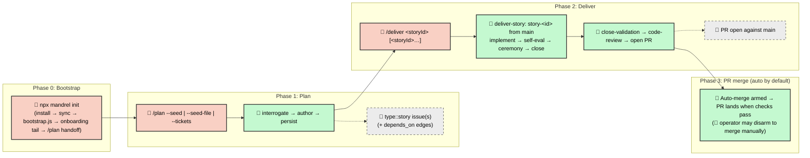

# Software Development Life Cycle (SDLC) Workflow

Mandrel uses **Story-centric GitHub orchestration** — GitHub Issues,
Labels, and Projects V2 are the Single Source of Truth. Plans persist as
`type::story` tickets ordered by `depends_on` edges;
each Story is delivered on its own `story-<id>` branch and reaches `main`
through its own PR.

An Epic may still exist as an **optional untyped human umbrella issue**
(no `type::epic` label and no shipped Epic issue form — only
`.github/ISSUE_TEMPLATE/story.yml`), but **delivery and planning
orchestration are Story-only**: there is no Epic wave loop, no
`epic/<id>` integration branch, no `epic.yaml` reconciler, and any ticket
that still carries an `Epic: #N` footer is **refused** by `/deliver`
(close it or re-plan it as a v2 Story).

The framework is **Claude Code-first**: `.claude/`, hooks, skills, and
the slash-command surface lean in on Claude Code as the reference
runtime, and the dispatcher (`.agents/scripts/`) treats the dispatch
manifest (md + structured comment) as the cross-runtime contract. See
ADR 20260512-coupling-stance in [`../docs/decisions.md`](../../docs/decisions.md).

---

## The simple flow

From zero to shipped:

1. **Plan the work.** Run [`/plan`](../workflows/plan.md) in your agentic
   IDE. The framework authors **one Story by default** (folded Tech Spec
   in `## Spec`), with N>1 only under the default-single split policy.

   Three operator modes (the **only** accepted entries):
   - `/plan --seed "<text>"` — ideate from chat text.
   - `/plan --seed-file <path>` — author from on-disk notes / a plan seed
     (this is the [`/audit-to-stories`](../workflows/audit-to-stories.md)
     handoff seam via `--emit-plan-seed`).
   - `/plan --tickets 123[,456…]` — analyze existing issue(s) into proper
     Stories (prefer an N=1 rewrite).

   `/plan` is a **single path** — there is no Epic/Story router, no
   scope-triage `epic|story` verdict, and no `deliveryShape`. All GitHub
   reads happen in `plan-context.js`, the issue-creating writes in
   `plan-persist.js`, and two HITL gates bracket the authoring middle.
   Duplicate search targets
   open **Stories** (`type::story`), never Epics.

   1. **Interrogate** — `plan-context.js` emits the single authoring
      envelope (open-Story duplicate candidates, codebase snapshot, BDD
      probe, risk heuristics, `systemPrompts.story`). Duplicate review
      folds into **gate #1**.
   2. **Author** — write `stories.json` (**one Story by default**) with a
      folded Tech Spec in `## Spec` / `## Slicing`. There is no risk artifact
      to author (Story #4542).
      Binding criteria live in top-level `acceptance[]` / `verify[]`;
      changes/references are `{ path, assumption }` objects. Split into
      N>1 only under the default-single split policy.
   2.5. **Critics** — `plan-critics.js` evaluates the consolidation +
      pre-mortem dispatch conditions against the authored draft and ledgers
      every skip. This is the **only** critic gate (#4592 moved it out of
      `plan-persist.js` into workflow prose), so skipping it silently skips
      both critics: run it before Persist, per
      [`/plan`](../workflows/plan.md) step 2.5.
   3. **Persist** — **gate #2** (raised only by an explicit `--force-review`)
      then `plan-persist.js` runs every deterministic gate and
      creates Story issue(s) with `type::story` + `agent::ready`, writing
      each authored `depends_on` edge into the sibling body as a
      `blocked by #<id>` footer when N>1.

2. **Deliver the Story.** Run [`/deliver <storyId>`](../workflows/deliver.md)
   (or `/deliver <a> <b> …` for several) in your IDE. `/deliver` takes
   only Story ids and resolves their dependency graph from live state —
   body edges union native GitHub `blocked_by` edges, with every blocker
   checked against its real issue state, so a Story whose blocker landed in
   an earlier plan run is simply ready. `/deliver` owns input resolution and
   `depends_on` sequencing only — every Story runs through
   [`helpers/deliver-story`](../workflows/helpers/deliver-story.md), the
   single v2 delivery engine. Per-Story it:

   1. **Init** (`single-story-init.js`) — acquires the Story lease, cuts
      `story-<id>` from `main`, materializes a worktree, flips to
      `agent::executing`.
   2. **Implement** — the agent delivers the Story in one guarded session
      against its inline `acceptance[]` / `verify[]` contract (optional
      `## Slicing` intra-session checkpoints).
   3. **Acceptance self-eval** — a bounded critic loop scores the
      caller-injected change set against each acceptance item before close (see
      [`helpers/acceptance-self-eval`](../workflows/helpers/acceptance-self-eval.md)).
   4. **Ceremony** — acceptance critic mode and review depth, both routed off
      the change level derived from the Story's own diff
      (`review-depth.js#deriveChangeLevel` → `ceremony-routing.js`).
   5. **Close** (`single-story-close.js`) — runs close-validation gates,
      the maker-blind Story-scope code review, pushes `story-<id>`, opens
      a PR to `main`, and (under the default `delivery.ci.autoMerge:
      "trust-ci"`) arms GitHub native auto-merge. The Story flips to
      `agent::closing` (issue stays OPEN).
   6. **CI watch + fix** — watches required checks to green, fixing and
      re-pushing on red.
   7. **Confirm merge** (`single-story-confirm-merge.js`) — on a confirmed
      `MERGED` PR the Story flips to `agent::done`; local branch cleanup
      and Projects-v2 Status re-assert run out-of-band.

   For a multi-Story run, `/deliver` sequences ready Stories by
   `depends_on` and runs the per-run epilogue (audit roster · follow-up
   roll-up · sibling coherence) once after the last Story lands.

That is the whole happy path. Everything below is **detail** — branching
conventions, HITL escalation, audit lenses — that you only need when the
default flow requires adjustment. It intentionally **links** to
[`plan.md`](../workflows/plan.md) and [`deliver.md`](../workflows/deliver.md)
rather than re-documenting the ceremony they own.

---

## Core Principles

- **Layered state stores with explicit precedence.** Ticket status lives
  in GitHub Issues and Labels; the lifecycle bus
  (`temp/run-<id>/lifecycle.ndjson`) is the canonical resume target for
  in-flight runs; structured comments (`verification-results`, retro) are
  the operator-visible rollup. The
  stores, their owners, and their conflict-resolution rules are listed in
  [§ State stores](#state-stores) — that matrix is the single source of
  truth for "who owns which write."
- **Provider Abstraction.** Orchestration flows through
  `ITicketingProvider`, an abstract interface with a shipped GitHub
  implementation.
- **Story-level branching.** All work for a Story lands on the shared
  `story-<id>` branch. Each Story reaches `main` through its own PR
  (squash + required checks); there is **no** `epic/<id>` integration
  branch and **no** `--no-ff` wave merge.
- **One delivery engine.** `/deliver` resolves and sequences a Story set;
  `helpers/deliver-story` executes each Story identically (trivial or
  large). Story sub-agents run inside the operator's Claude session via
  the Agent tool — worktree filesystem isolation is preserved; only the
  subprocess boundary is gone.
- **PR is the sole promotion gate.** Delivery ends with a PR open against
  `main` and (by default) GitHub native auto-merge armed; the workflow
  itself never executes `git merge` against `main`. Branch protection on
  `main` enforces required checks before the merge button (auto or
  manual) fires.
- **HITL-minimal by default.** Exactly one mandatory operator touchpoint
  on the happy path — blocker resolution mid-run. PR merge is autonomous
  via the armed auto-merge; the operator becomes a second touchpoint only
  when they disarm auto-merge (`--no-auto-merge` / `delivery.ci.autoMerge:
  "strict"`) or when required checks fail and need remediation.

---

## State stores

Mandrel writes orchestration state across several distinct stores. Each
store has one canonical writer and one well-defined idempotency key;
conflicts are resolved in the **Conflict resolution** column. Run-scoped
artifacts live under `temp/run-<id>/` (standalone Stories under
`temp/standalone/stories/story-<id>/`); the `run-<id>` directory naming is
historical (it predates the Story-centric cutover) but remains the live
on-disk layout resolved by
[`lib/config/temp-paths.js`](../scripts/lib/config/temp-paths.js).

| State Store | Owner (canonical writer) | Mutation API | Idempotency key | Conflict resolution |
| --- | --- | --- | --- | --- |
| GitHub labels | `transitionTicketState` via `ticketing.js` | `gh issue edit --add-label / --remove-label`, wrapped in `update-ticket-state.js` | `(ticketId, label-set)` — set-equality before write | Authoritative for current ticket lifecycle state; if a label disagrees with the lifecycle ledger, the **ledger wins on resume** and the label is re-derived. |
| `verification-results` comment | `lib/orchestration/code-review.js` | `post-structured-comment.js` (upsert by `kind`) | `(storyId, kind='verification-results')` | Authoritative for the Story-scope review + lens findings; critical findings block close. |
| Lifecycle ledger NDJSON | `LedgerWriter` (`lib/orchestration/lifecycle/ledger-writer.js`, registered as the first listener on every bus event — single append-only writer per run) | Append-only line write to `temp/run-<id>/lifecycle.ndjson` | `(runId, eventId)` — `eventId` is a content hash of `{type, ts, payload}` | **Canonical resume target.** When labels / comments disagree with the ledger, the ledger wins and the others are re-derived. |
| Validation evidence cache | `evidence-gate.js` | JSON cache file under the run temp tree, keyed by HEAD SHA | `(gate, git rev-parse HEAD)` | Pure cache: a missing entry triggers a re-run; presence is a fast-path skip. Cache eviction is safe. |
| PR / auto-merge state | `single-story-close.js` (sole authorized caller of `gh pr merge`) | `gh pr merge --auto --squash --delete-branch`; PR open via the close pipeline's `gh pr create` | `(prNumber, head-branch SHA)` — `gh pr list --head` probes before create | GitHub is authoritative for PR + auto-merge arming state; the ledger records the *intent* to arm, GitHub records the outcome. |
| Worktree cleanup state | `WorktreeManager.reap` (via `single-story-close.js` / `git-cleanup.js`) | `git worktree remove` + on-disk pending-cleanup JSON under the run temp tree | `(storyId, worktree-path)` | Filesystem is authoritative for "is the worktree gone?"; the pending-cleanup JSON only tracks stale-registry entries needing a follow-up sweep. |

> The `gh pr merge` merge-lockout lint rule keeps the merge command
> confined to the sanctioned close path; no other production caller may
> shell it.

---

## End-to-End Process



---

## Phase 0: Bootstrap (one-time setup)

Before any workflow, bootstrap your project to seed `.agentrc.json`, wire
the framework system prompt, and create the GitHub labels, Projects V2
fields, and (when enabled) main-branch protection the orchestration engine
depends on.

The canonical cold-start path is a single command:

```bash
npx mandrel init
```

`mandrel init` installs `mandrel` (when `./.agents/` is absent),
materializes `./.agents/` via `mandrel sync`, then presents a two-option
prompt: **configure now** (option 1 → runs `node
.agents/scripts/bootstrap.js`, forwarding any flags you pass) or **just
the files** (option 2 → re-run `mandrel init` any time to configure
later). `--assume-yes` skips the prompt and proceeds straight to configure;
a non-TTY run without it defaults to files-only so GitHub provisioning
never runs unattended. `bootstrap.js`:

1. **Provisions a cold start.** Initializes the local git repo (with a
   first commit) when absent, creates the GitHub repo (`gh repo create
   --source=. --push`; choose visibility with `--visibility
   private|public|internal`, default `private`), and creates the Projects
   V2 board (`gh project create`) when it doesn't exist. No pre-created
   repo or remote is required.
2. **Seeds `.agentrc.json`** from `.agents/starter-agentrc.json` (the
   `github` section carries owner, repo, base branch, operator handle, and
   project number — inferred from your local `git` config where possible).
   See `.agents/docs/agentrc-reference.json` for the exhaustive key
   reference.
3. **Creates the label taxonomy and Projects V2 fields**, and — when
   `github.branchProtection.enforce` is `true` (default) — creates or
   merges branch protection on `main` with the project's
   `github.branchProtection.requiredChecks` as required status checks.
   This step is load-bearing because PR merges to `main` are the sole
   promotion gate.

When `.agents/` is already materialized you can run the bootstrap directly
(`node .agents/scripts/bootstrap.js`). The guided first-run steps (stack
detection, docs scaffolding, `mandrel doctor` readiness gate, and `/plan`
handoff) are part of `mandrel init`'s configure path.

> [!NOTE] Bootstrap runs once per repository. It is safe to re-run —
> existing labels, fields, and branch-protection entries are preserved;
> missing ones are added.

---

## Phase 1: Planning

Planning is owned end-to-end by [`/plan`](../workflows/plan.md). Rather than
re-document the ceremony here, this section states the contract the rest of
the SDLC depends on:

- **Entry is text or tickets, never Epic.** The only accepted invocations
  are `--seed`, `--seed-file`, and `--tickets`. There is no `--idea`, no
  `--one-pager`, no `--from-notes`, and no positional `/plan <epicId>`.
- **One Story by default.** `/plan` authors a single `type::story` issue
  whose body carries a folded `## Spec` (inline only — never spilled to
  `docs/`) plus top-level `acceptance[]` / `verify[]`. It splits into N>1
  siblings (ordered by `depends_on` edges) **only**
  under the default-single split policy: near-zero overlap or a genuine
  architectural seam. Coupled work stays one Story and is decomposed inside
  `## Slicing` as intra-session checkpoints, not sibling tickets.
- **No Epic-scale ceremony on the default path.** N=1 skips the
  Epic-era Tech Spec / Acceptance Table / clarity-gate / decompose /
  reconciler machinery. `plan-persist.js` runs the deterministic gates
  (ticket validator, split policy, reachability, budget) and — for N>1 —
  `assertAcceptancePartition` so every acceptance criterion belongs to
  exactly one Story.
- **Handoff.** Persist creates the Story issue(s) at `agent::ready` and
  names the delivery command: `/deliver <storyId> [<storyId> ...]`.

Optional split advisory notes come from
[`core/scope-triage`](../skills/core/scope-triage/SKILL.md); there is no
`epic|story` routing verdict, scorer, schema field, or label transition
behind them.

Audit findings enter planning through
[`/audit-to-stories`](../workflows/audit-to-stories.md), which groups and
deduplicates findings and hands off via `--emit-plan-seed` →
`/plan --seed-file <path>`.

---

## Phase 2: Delivery

Delivery is owned end-to-end by [`/deliver`](../workflows/deliver.md), which
delegates every Story to
[`helpers/deliver-story`](../workflows/helpers/deliver-story.md). This
section states the contract; the per-Story step detail (init, implement,
self-eval, ceremony, close, CI watch, confirm-merge, cleanup) lives in the
`deliver-story` workflow and its
[reference](../workflows/helpers/deliver-story-reference.md).

### Invocation modes

| Mode | Entry point | When to use |
| --- | --- | --- |
| **Single Story** | `/deliver <storyId>` | Deliver one Story end-to-end; ends with a PR open to `main`. |
| **Story set** | `/deliver <storyId> [<storyId>…]` | Deliver multiple Stories in `depends_on` order (default concurrency **3**), resolved from live state so edges may point at Stories from earlier plan runs; each lands through its own PR, and the per-run epilogue runs after the set lands. |
| **Story worker (internal)** | *helper* `helpers/deliver-story <storyId>` | Per-Story engine invoked internally by `/deliver`; not an operator slash command. |

The single operator-facing entry point is `/deliver`. It performs no
git/label mutations itself — `deliver-story` owns every script invocation
per Story. Any ticket that is not `type::story`, or that still carries an
`Epic: #N` reference, is a hard error naming the ID and the fix (close or
re-plan as a v2 Story).

### Branch model (authoritative)

```text
story-<id>  →  PR  →  main (squash + required checks)
```

There is no `epic/<id>` integration branch and no `--no-ff` wave merge.
Dependent Stories land sequentially so each builds on the previous merge to
`main`.

### Ceremony

Ceremony depth is selected by `delivery.routing.ceremonyProfile`
(`minimal` | `standard` | `strict`, default `standard`) and the Story's
own planning risk. Hard gates (lint / test / format / coverage / CRAP /
maintainability) always run at close — risk never disables them; it only
tunes acceptance-critic mode, review depth, and audit-lens selection. The
full profile × scope matrix lives in
[`deliver.md` § Ceremony](../workflows/deliver.md).

### State sync

Agents update their state in real time on GitHub, always through
`update-ticket-state.js`:

- **Labels**: `agent::ready` → `agent::executing` → `agent::closing` →
  `agent::done`. The `agent::done` flip happens only after
  `single-story-confirm-merge.js` confirms the PR merged. When a
  `projectNumber` is configured, the Projects v2 Status column is synced on
  each transition (and re-asserted after merge to beat the board's late
  built-in write).
- **Acceptance/verify**: the agent works the Story's inline `acceptance[]`
  / `verify[]` arrays; `verify[]` commands are consumed as required
  evidence by the acceptance self-eval loop.
- **Friction**: friction is posted as a structured comment on the **Story**
  (`diagnose-friction.js`), and rolls up into the retro and, for N>1, the
  per-run follow-up roll-up.

### Cross-clone coordination

Concurrent runs are serialised by **two distinct layers**:

- **Filesystem locks are same-machine-only.** The single-story sweep lock
  (`sweep-lock.js`) is a single-file rendezvous keyed on a local process
  PID + mtime TTL. Because a PID is only meaningful on its own machine and
  `.git/` is never committed, these locks coordinate only the worktrees and
  sessions on **one** clone.
- **The assignee-as-lease is the cross-clone layer.** To stop two clones
  from both *starting* the same Story, `deliver-story` takes an exclusive,
  time-bounded claim on the ticket via
  [`ticket-lease.js`](../scripts/lib/orchestration/ticket-lease.js), riding
  the ticket's GitHub `assignees` field so a live foreign claim is visible
  to every clone. The standalone lease **fails closed** on a foreign
  assignee; `--steal` is the only override. See
  [`README.md` § Multi-developer coordination](../README.md#multi-developer-coordination).

### Concurrent close

`single-story-close.js` syncs the Story branch from `origin/main` before
pushing and opening/locating the PR, so concurrent closes serialize through
their own worktrees rather than racing one shared branch. The push does not
retry: a rejected push, or a real content conflict at base-sync, aborts with
a clear error, leaves the tree clean, and exits non-zero for manual
resolution.

---

## HITL (Human-in-the-Loop) model

On the happy path there is exactly **one** mandatory operator touchpoint
after `/deliver` fires (blocker resolution). PR merge is autonomous via
armed auto-merge; the operator becomes a second touchpoint only by
exception.

1. **Blocker resolution (mandatory when triggered).** If a Story hits an
   unresolvable condition, it flips to `agent::blocked`, posts a structured
   friction comment, and fires the notification webhook (fire-and-forget).
   The operator resolves the underlying issue (a hand-fix commit on the
   Story branch, or a scope edit on the ticket) and flips the Story back to
   `agent::executing` to resume.
2. **PR merge (autonomous by default; operator-gated by exception).** At
   close, `deliver-story` opens a PR to `main` and arms GitHub native
   auto-merge. When required checks pass, the PR lands without a second
   operator visit and the standard label transition flips the Story to
   `agent::done`. The operator becomes a touchpoint only when they (a)
   disarm auto-merge (`--no-auto-merge` per run, or
   `delivery.ci.autoMerge: "strict"`) to inspect checks / the
   `verification-results` comment / the retro before merging by hand, or
   (b) checks fail and need remediation.

### What triggers `agent::blocked`

- Unresolvable merge conflict automated strategies cannot reconcile.
- Test failures that persist after automated remediation.
- Ambiguity requiring a product/scope decision the agent cannot make from
  ticket context alone.
- A destructive action not pre-authorized by the ticket body.
- External-service failure preventing progress (GitHub API 5xx loop, npm
  registry down).
- Acceptance self-eval exhausting its bounded round cap with criteria still
  unmet.

### What is *not* gated at runtime

- `risk::high` Stories **run without pause.** The label is planning/audit
  metadata and retro telemetry only; the sole runtime pause point is
  `agent::blocked`. Branch protection on `main` and blocker escalation are
  the runtime defenses for destructive actions.
- Individual Story completion — no per-Story approval prompt beyond the PR
  merge gate.

---

## Testing strategy

Tests are **pyramid-aware**. Every test written during Story delivery
belongs to exactly one tier — **unit**, **contract**, or **e2e /
acceptance**. The canonical tier definitions, assertion-placement rules,
and coverage thresholds live in
[`rules/testing-standards.md`](../rules/testing-standards.md); Gherkin
authoring for the acceptance tier is governed by
[`rules/gherkin-standards.md`](../rules/gherkin-standards.md).

Write a Story's acceptance criteria in Gherkin-compatible `Given / When /
Then` form so the acceptance suite can lift them into executable `.feature`
files.

### QA workflows: explore, assist, and run-harness

Three complementary QA workflows sit alongside the automated pyramid, all
reading the consumer's `qa.*` contract from `.agentrc.json` through
[`scripts/lib/qa/resolve-qa-contract.js`](../scripts/lib/qa/resolve-qa-contract.js)
(which fails loudly when no `qa` block is bound):

- **[`/qa-explore`](../workflows/qa-explore.md)** — an **agent-led**,
  open-ended **Plan → Capture → Triage** exploratory sweep. The operator
  names a surface; the agent drives it (browser MCP by default), recording
  each observation as a `QaLedgerItem`
  ([`schemas/qa-ledger.schema.json`](../schemas/qa-ledger.schema.json)) in a
  session ledger under `temp/qa/`. Capture is strictly **read-only**; every
  state-changing action lands in Triage after explicit operator
  confirmation.
- **[`/qa-assist`](../workflows/qa-assist.md)** — the **human-led** sibling:
  a single-observation **Intake → Enrich → Record** loop. The operator
  reports one observation; the agent enriches it into a triage-ready
  `QaLedgerItem`. Same ledger contract and decision seams as `/qa-explore`.
- **[`/qa-run`](../workflows/qa-run.md)** — the **automated complement**:
  steps a *known* set of Gherkin `.feature` scenarios through a real
  browser, asserting `Then` outcomes against the accessibility snapshot and
  bundling console/network problems into structured `F#` findings.

Consumer adoption steps are in
[`README.md` § Adopting the QA harness](../README.md#adopting-the-qa-harness).

---

## Static analysis & audit orchestration

Audit lenses are woven into delivery as a **shift-left, three-tier**
verification model in which each lens concern is verified at exactly one
tier, chosen by the lens's `scope` field in `audit-rules.json` (resolved by
`resolveLensTier`). There is **no** separate Epic-lifecycle-gate delivery
pass — the tiers below *are* the audit machinery.

| Tier | When | What runs | Blocking? |
| --- | --- | --- | --- |
| Tier 1 — write-time | During Story implementation | Footprint-matched **local**-lens authoring checklists threaded into the Story prompt (`checklistPath`) | advisory |
| Tier 2 — Story-scope | `single-story-close.js` (maker-blind subprocess) | Local-tier lens roster over the Story diff (`selectLocalLenses`) + review pillars, posted as `verification-results` | blocking on 🔴 |
| Tier 3 — run closeout | `/deliver` per-run epilogue (`plan-run-epilogue.js`, N>1 only) | Cumulative + global lenses (`selectAudits`) over the combined landed tip | blocking |

- **`local`** lenses (decidable from a single Story's diff) are verified at
  Tiers 1–2 and are **not** re-run at run closeout.
- **`cumulative`** lenses (only decidable across a run's combined diff)
  and **`global`** lenses (whole-product properties) are verified at Tier 3.

There is no risk-routed lens tier. Story #4542 deleted the risk→lens router:
it had zero callers while this document claimed it ran inside close. Lens
selection is change-set-matched (`selectAudits` / `selectLocalLenses`); the
`sensitivePaths` classes in `audit-rules.json` route review **depth**, not
lenses.

The run-closeout roster is deliberately **slim**: it excludes every
local-tier change-set lens so the outermost tier — where a fix is most
expensive — does not re-verify a concern already covered shift-left.

### Code review

The Story-scope code review runs **outside the maker's context**, inside
the `single-story-close.js` close subprocess, over `main...story-<id>`
(see [`helpers/code-review.md`](../workflows/helpers/code-review.md)). It
walks the Story diff once, executing the change-set-matched local lens roster
as review dimensions alongside the review pillars, and posts the unified
`verification-results` comment. Remediation is tier-aware and split by
finding class off `delivery.codeReview.autoFixSeverity` (default `medium`);
surviving 🔴 Critical findings halt the run. The legacy `scope: epic`
Epic-branch review path was removed with the v2 cutover.

### Quality ratchets

- **Maintainability ratchet** (`check-baselines.js` via
  `lib/baselines/kinds/maintainability.js`) — fails if the
  composite score drops below the established baseline.
- **CRAP gate** (`check-baselines.js` via `lib/baselines/kinds/crap.js`) —
  per-method complexity × coverage risk
  against `baselines/crap.json`, wired into close-validation, `ci.yml`, and
  `.husky/pre-push`. The `baseline-refresh: true` commit-trailer convention
  is the project standard for baseline edits (see
  [`core/gates-and-baselines`](../skills/core/gates-and-baselines/SKILL.md)).

### Audits → Stories

The standalone `/audit-<dimension>` workflows are read-only emitters that
write `audit-<dimension>-results.md` under `temp/audits/`.
[`/audit-to-stories`](../workflows/audit-to-stories.md) parses those
reports, groups and deduplicates findings, and hands off to
`/plan --seed-file` (or opens standalone Stories) — closing the loop back
into planning.

---

## Notification system

Two independent notification surfaces, both living in `.agents/` so they
ship to consuming projects.

### 1. Unified `notify()` dispatcher

Every notification — whether a manual orchestration milestone (Story
merged, HITL gate triggered) or an auto-fired ticket-state transition —
routes through [`notify.js`](../scripts/notify.js). Two delivery channels:

| Channel | What it does |
| --- | --- |
| GitHub comment | Posts to the targeted ticket; @mentions the operator for `medium`/`high`. |
| Webhook | Fire-and-forget POST to the configured URL (Make.com / Slack / Discord). |

Severity vocabulary (`eventSeverity()` derives it for state transitions):

| Severity | Used for | Webhook prefix |
| --- | --- | --- |
| `low` | Intermediate transitions, audit reports. | `[low]` |
| `medium` | Operator-visible milestones: Story state transitions, story merged, run complete. | `[medium]` |
| `high` | Operator must act (HITL gates, Story blockers, autonomous-chain failures); body leads with `🚨 Action Required:`. | `[Action Required]` |

Two independent event-allowlist knobs in `github.notifications` (both
mandatory) filter each channel independently — there is no fallback chain:

- `commentEvents` — allowlist for GitHub-ticket comment posting. Default:
  `["state-transition", "story-merged", "operator-message"]`.
- `webhookEvents` — allowlist for `NOTIFICATION_WEBHOOK_URL` deliveries.

`transitionTicketState` suppresses the `notify()` dispatch for low-severity
transitions so the comment channel sees only the medium-severity
Story-level events operators expect. To suppress a channel entirely, set
its array to `[]`.

**Webhook URL resolution.** `NOTIFICATION_WEBHOOK_URL` process env var only
— loaded from `.env` at the project root. It is **not** sourced from
`.agentrc.json` or `.mcp.json`.

Because `notify()` is called in-band from the orchestration SDK, it
captures state changes from `deliver-story`, the per-Story scripts
(`single-story-init.js`, `single-story-close.js`,
`single-story-confirm-merge.js`), and any script that routes through
`transitionTicketState`. It does **not** capture manual label clicks in the
GitHub UI.

### 2. Blocker / HITL notifications

Fire-and-forget webhooks fire on blocker-escalation events
(`agent::blocked`) and operator-attention events (PR-open hand-off, run
cancellation). Webhook failures never block execution.

---

## Troubleshooting

### Sub-agent CI workflow editing

Sub-agents operating under the framework's default `GITHUB_TOKEN` **cannot
edit files under `.github/workflows/**`** — the token does not carry the
`workflows` permission scope, so a push touching a workflow file is
rejected with:

> refusing to allow a GitHub App to create or update workflow
> `.github/workflows/<file>.yml` without `workflows` permission

This is a hard constraint, not a transient failure. **When a Story plans a
new CI gate**, route the check through a `package.json` script (add it to
`npm run lint` / `npm run docs:check` / `npm test`, or wire a new
`npm run check:<name>` script) so an existing CI job picks it up by
transitivity. **When a workflow file genuinely must change** (a new job, a
trigger change, a runner bump), the edit must be made by an operator with
`Workflows: Read and write` PAT permissions — see
[`docs/release-operations.md` § One-time PAT setup](../../docs/release-operations.md#one-time-pat-setup).

### Worktree config shadow

`helpers/deliver-story` runs inside per-Story worktrees under
`.worktrees/story-<id>/`. A worktree checks out the **Story branch's own
copy** of every repo-tracked file — including `.agentrc.json`. **Operator
edits made in the main checkout do NOT propagate to an already-active
worktree.** Symptom: you bump a runtime knob in `<main-repo>/.agentrc.json`,
re-run `single-story-close.js --cwd <worktree>`, and the script still uses
the old value. When tuning knobs mid-Story:

1. **Prefer an env-var override** when the knob exposes one (timeouts,
   `AGENT_LOG_LEVEL`, concurrency caps) — env vars are read from your shell,
   bypassing worktree shadow entirely.
2. **Edit the file inside the worktree** (`.worktrees/story-<id>/.agentrc.json`)
   so the script sees the bump on its next read.
3. **Use `.agentrc.local.json`** for per-machine tuning you never commit
   (see
   [`configuration.md`](configuration.md#per-machine-local-overrides)) —
   place it inside the worktree, or invoke the script with
   `--cwd <main-repo>` so the resolver reads the main checkout's override.

Editing the main checkout's `.agentrc.json` only affects **the next**
`single-story-init.js` invocation, because new Story branches fork from
`main`'s current tip.

### `Epic: #N` refusal

`/deliver` refuses any ticket that still carries an `Epic: #N` footer or is
not `type::story`. This is expected — v2 has no Epic delivery path. Close
the ticket or re-plan the work as a v2 Story via `/plan --tickets <id>`.

---

## Quick reference

| Command | Purpose |
| --- | --- |
| `npx mandrel init` | Cold-start — install `mandrel` (if absent), `mandrel sync`, `bootstrap.js` (provisions repo + Projects V2 board, labels, branch protection), then the onboarding tail (stack detection, docs scaffolding, doctor gate, `/plan` handoff). |
| `/plan --seed "<text>"` | Plan from chat text — interrogate → author **one Story by default** → persist `type::story`. |
| `/plan --seed-file <path>` | Plan from on-disk notes / a plan seed (the `/audit-to-stories` handoff). |
| `/plan --tickets <ids>` | Analyze existing issue(s) into proper Stories (prefer an N=1 rewrite). |
| `/deliver <storyId>` | Deliver one Story via `helpers/deliver-story` — `story-<id>` → PR → `main`. |
| `/deliver <storyId> [<storyId>…]` | Deliver multiple Stories in `depends_on` order (resolved from live state), then run the per-run epilogue. |
| *helper* `helpers/deliver-story` | Per-Story engine invoked by `/deliver`; not an operator slash command. See [`deliver-story.md`](../workflows/helpers/deliver-story.md). |
| `/audit-to-stories` | Convert audit findings into a plan seed / Stories → `/plan --seed-file`. |
| `/qa-explore` · `/qa-assist` · `/qa-run` | Agent-led / human-led exploratory QA and the automated Gherkin harness. |
| `/git-deliver` | Ad-hoc delivery of working-tree changes — detects the git setup and escalates to commit, commit + push, or commit + push + PR (auto-merge armed). |
